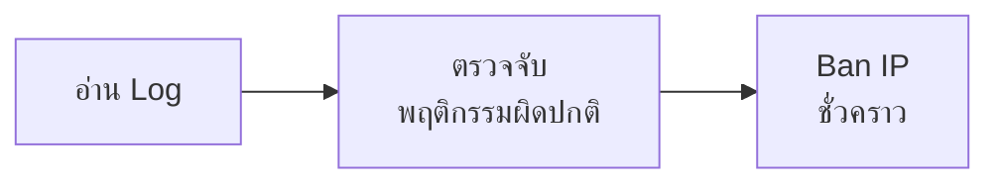

import ChatMessage from "../../../components/ChatMessage.astro";

Fail2Ban เป็นโปรแกรมด้าน Security สำหรับ Linux ที่ช่วยป้องกันการโจมตีแบบ Brute Force หรือการพยายาม Login ซ้ำ ๆ โดยไม่สำเร็จ เช่น บอทที่คอยสุ่ม Username/Password เพื่อพยายามเข้า SSH, Database หรือ Service อื่น ๆ ที่เปิดให้เข้าถึงจาก Network

หลักการทำงานของ Fail2Ban



## ตัวอย่างการทำงาน

ก่อนติดตั้ง Fail2Ban

<ChatMessage
  message="เห็น ssh port 22 เปิดอยู่ ลองสุ่มเข้าดีกว่า"
  avatarKey="blackCat"
/>
<ChatMessage message="admin/123456... ไม่ผ่าน" avatarKey="blackCat" />
<ChatMessage message="root/toor... ก็ไม่ผ่าน" avatarKey="blackCat" />
<ChatMessage
  message="ubuntu/password... ก็ยังไม่ผ่านอีก"
  avatarKey="blackCat"
/>
<ChatMessage
  message="ไม่โดน block ซะที แบบนี้ก็สบายเลย 😈 สุ่มต่อไปเรื่อยๆ จนกว่าจะเข้าได้ละกัน"
  avatarKey="blackCat"
/>

> Hacker ยังสุ่มได้ไม่จำกัด และทุกครั้งที่ login ผิด ระบบก็แค่บันทึก log ไว้เฉย ๆ ไม่ได้ป้องกันอะไร

หลังติดตั้ง Fail2Ban

<ChatMessage
  message="งั้นลองต่อ... admin/qwerty ก็ยังไม่ใช่"
  avatarKey="blackCat"
/>
<ChatMessage
  message="ต่อด้วย root/letmein... เอ๊ะ ทำไม connection หลุด?"
  avatarKey="blackCat"
/>
<ChatMessage
  message="เดี๋ยวนะ... ต่อ SSH ไม่ได้แล้ว นี่ IP โดนแบนเหรอเนี่ย"
  avatarKey="blackCat"
/>
<ChatMessage
  message="โห แบนตั้ง 24 ชั่วโมง หมดสิทธิ์ลองต่อเลย"
  avatarKey="blackCat"
/>
<ChatMessage
  message="เรียบร้อย 😎 Fail2Ban จัดการให้เอง โดนแบนไปซะพวก hacker"
  isFromMe="true"
  avatarKey="whiteCat"
/>

> Hacker พยายาม Login SSH ผิดครบ 3 ครั้ง ภายใน 10 นาที ระบบจะ Block IP นั้นทันที 24 ชั่วโมง

## Installation

```bash
# ติดตั้ง
sudo apt-get install fail2ban -y

# ตรวจสอบสถานะ
sudo systemctl status fail2ban

# เปิดใช้งานและให้เริ่มอัตโนมัติตอน boot
sudo systemctl enable --now fail2ban

# ตรวจสอบเวอร์ชัน
fail2ban-client version
```

## ตั้งค่า SSH

โดย default จะมีการตั้งค่า jail `sshd` ไว้อยู่แล้ว แต่ควรปรับแต่งเพิ่ม เปิดไฟล์ด้วยคำสั่ง:

```bash
nano /etc/fail2ban/jail.d/defaults-debian.conf
```

ใส่ config ดังนี้:

```ini
[sshd]
enabled  = true
maxretry = 3
findtime = 10m
bantime  = 24h
```

reload config และตรวจสอบค่า:

```bash
# reload config
sudo fail2ban-client reload

# เช็คว่า bantime ถูกอัพเดทหรือยัง (ต้องขึ้น 86,400 = 24 ชั่วโมง)
sudo fail2ban-client get sshd bantime
```

<ChatMessage
  message="86,400 วินาที = 24 ชั่วโมง ถ้าขึ้นค่านี้แสดงว่า bantime = 24h ถูกต้อง"
  avatarKey="blackCat"
/>

## Config

โดยทั่วไปไฟล์ config จะอยู่ใน `/etc/fail2ban/`

### โครงสร้างไฟล์

| ไฟล์/Path         | ความหมาย                                                         |
| ----------------- | ---------------------------------------------------------------- |
| `fail2ban.conf`   | config หลักของ daemon                                            |
| `jail.conf`       | config ตัวอย่างของ jail (ไม่ควรแก้ไฟล์นี้โดยตรง)                 |
| `jail.d/*.conf`   | ไฟล์ override config ของ jail ที่จะถูก merge เข้ากับ `jail.conf` |
| `filter.d/*.conf` | regex สำหรับ parse log แต่ละ service                             |
| `action.d/*.conf` | action ที่ใช้ตอน ban เช่น iptables, route                        |

### ความหมายของ property หลัก

| Property   | ความหมาย                              |
| ---------- | ------------------------------------- |
| `enabled`  | เปิด/ปิดการทำงานของ jail              |
| `maxretry` | จำนวนครั้งที่ login ผิดได้ก่อนโดน ban |
| `findtime` | ช่วงเวลาที่ใช้นับ (เช่น `10m`, `1h`)  |
| `bantime`  | ระยะเวลาที่ ban (เช่น `24h`, `1d`)    |
| `port`     | port ที่ jail ดูแล                    |
| `logpath`  | path ของ log ที่จะอ่าน                |
| `filter`   | ชื่อ filter (regex) ที่ใช้ parse log  |

## คำสั่งที่ใช้บ่อย

```bash
# 1. ดูว่ามี Jail อะไรทำงานอยู่
sudo fail2ban-client status

# 2. ดูรายละเอียดของ jail (เช่น sshd)
sudo fail2ban-client status sshd

# 3. ดู IP ที่โดน ban
sudo fail2ban-client get sshd banip

# 4. ปลด ban
sudo fail2ban-client set sshd unbanip 49.22.177.139

# 5. ban IP เอง
sudo fail2ban-client set sshd banip 49.22.177.139

# 6. ดู log สด
sudo tail -f /var/log/fail2ban.log

# 7. ตรวจสอบ config ว่าถูกไหม
sudo fail2ban-client -t

# 8. reload หลังแก้ config
sudo fail2ban-client reload
```

<ChatMessage
  message="ทุกครั้งที่แก้ config ควรรัน fail2ban-client -t ก่อน reload เพื่อเช็ค syntax ถ้า config ผิดจะแจ้งเตือนก่อน service พัง"
  avatarKey="blackCat"
/>

## คำสั่ง Get config

```bash
# ดูค่า config ของ jail
sudo fail2ban-client get <jail> <property>

# จำนวนครั้งที่ login ผิดได้
sudo fail2ban-client get sshd maxretry

# เวลาที่ ban (วินาที)
sudo fail2ban-client get sshd bantime

# ช่วงเวลาที่ใช้นับ (วินาที)
sudo fail2ban-client get sshd findtime
```

## ตัวอย่าง Jail อื่น ๆ

นอกจาก `sshd` สามารถเปิด jail อื่น ๆ เพิ่มได้ เช่น:

```ini
# /etc/fail2ban/jail.d/custom.conf

[sshd]
enabled  = true
maxretry = 3
findtime = 10m
bantime  = 24h

[nginx-http-auth]
enabled  = true
maxretry = 5
findtime = 10m
bantime  = 1h

[postgresql]
enabled  = true
maxretry = 5
findtime = 10m
bantime  = 24h
port     = 5432
logpath  = /var/log/postgresql/postgresql-*-main.log
```

<ChatMessage
  message="fail2ban มี filter สำเร็จรูปให้ใช้เยอะมาก ดูได้ที่ /etc/fail2ban/filter.d/ หรือสร้างเองก็ได้"
  avatarKey="whiteCat"
/>

## Tips

> ถ้าต้อง whitelist IP บางตัวไม่ให้โดน ban (เช่น IP ของทีม) สามารถเพิ่ม `ignoreip` ใน jail config ได้

```ini
[DEFAULT]
ignoreip = 127.0.0.1/8 192.168.1.0/24

[sshd]
enabled  = true
maxretry = 3
findtime = 10m
bantime  = 24h
```
