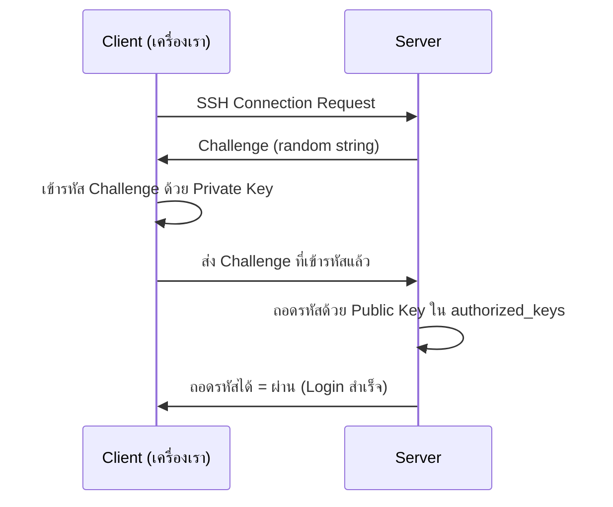

import ChatMessage from '../../../components/ChatMessage.astro';

## SSH (Secure Shell)

SSH คือโปรโตคอลสำหรับเข้าถึงเครื่อง Server ระยะไกลผ่าน terminal โดยข้อมูลทุกอย่างจะถูกเข้ารหัส ปลอดภัยกว่า Telnet ที่ส่งข้อมูลเป็น plain text

ฟีเจอร์หลัก:
- เข้าถึง Server ผ่าน command line
- รันคำสั่งบนเครื่องระยะไกล
- ส่งไฟล์ระหว่างเครื่อง (SCP / SFTP)
- สร้าง tunnel / port forwarding

## SSH เบื้องต้น

```bash
# เข้า Server แบบระบุ user
ssh user@192.168.1.10

# เข้า Server ด้วย port อื่น (default คือ 22)
ssh -p 2222 user@192.168.1.10

# ระบุ private key ที่ใช้เชื่อมต่อ
ssh -i ~/.ssh/id_rsa user@192.168.1.10

# รันคำสั่งบน Server โดยไม่ต้องเข้า shell
ssh user@192.168.1.10 "ls -la /var/www"
```

## การสร้าง Private Key และ Public Key

SSH ใช้การเข้ารหัสแบบ **Public Key Cryptography** ประกอบด้วย key 2 ตัว:

- **Private Key** → อยู่ฝั่ง Client (เครื่องเรา) ห้ามเปิดเผยเด็ดขาด
- **Public Key** → เอาไปวางไว้ฝั่ง Server ในไฟล์ `~/.ssh/authorized_keys`

### Generate Key

```bash
# สร้าง key แบบ ed25519 (แนะนำ ปลอดภัยและเร็ว)
ssh-keygen -t ed25519

# สร้าง key แบบ RSA 4096 bits
ssh-keygen -t rsa -b 4096

# สร้าง key และตั้งชื่อไฟล์เอง
ssh-keygen -t ed25519 -f ~/.ssh/my_server_key

# สร้าง key แบบไม่ต้องตั้ง passphrase (ใช้สำหรับ automation)
ssh-keygen -t ed25519 -N "" -f ~/.ssh/id_ed25519
```

> ถ้าไม่ระบุ path จะถูกสร้างที่ `~/.ssh/id_<algorithm>` เช่น `~/.ssh/id_ed25519` และ `~/.ssh/id_ed25519.pub`

<ChatMessage message="ไฟล์ที่ลงท้ายด้วย `.pub` คือ Public Key ส่งให้ใครก็ได้ ส่วนไฟล์ที่ไม่มี `.pub` คือ Private Key ห้ามหลุดเด็ดขาด" avatarKey="blackCat" />

<ChatMessage message={'ถ้าใช้ `-N ""` จะไม่มี passphrase สะดวก แต่ถ้า Private Key หลุดก็โดนเข้า Server ได้เลย ควรใช้ `ssh-agent` แทน'} isFromMe="true" />

<ChatMessage message="ssh-agent เก็บ passphrase ไว้ใน memory พอใส่ครั้งเดียวก็ใช้ได้ตลอด session ไม่ต้องพิมพ์ซ้ำ" avatarKey="blackCat" />

## เข้า Server แบบไม่ต้องใส่ Password (Passwordless Login)

### ขั้นตอน

```bash
# 1. generate key (ถ้ายังไม่มี)
ssh-keygen -t ed25519

# 2. copy public key ไปยัง Server (วิธีที่ง่ายที่สุด)
ssh-copy-id user@192.168.1.10

# 3. ทดสอบ login (จะไม่ถาม password แล้ว)
ssh user@192.168.1.10
```

> `ssh-copy-id` จะ copy public key ไปต่อท้ายไฟล์ `~/.ssh/authorized_keys` บน Server ให้อัตโนมัติ

### ถ้าใช้ ssh-copy-id ไม่ได้

```bash
# copy public key ไปวางบน Server ด้วยตัวเอง
cat ~/.ssh/id_ed25519.pub | ssh user@192.168.1.10 "mkdir -p ~/.ssh && chmod 700 ~/.ssh && cat >> ~/.ssh/authorized_keys && chmod 600 ~/.ssh/authorized_keys"
```

### Permission ที่ถูกต้องบน Server

```bash
chmod 700 ~/.ssh
chmod 600 ~/.ssh/authorized_keys
chmod 600 ~/.ssh/id_ed25519
chmod 644 ~/.ssh/id_ed25519.pub
```

<ChatMessage message="ถ้า permission ผิด SSH จะปฏิเสธไม่ให้ใช้ key เพราะถือว่าไม่ปลอดภัย" avatarKey="blackCat" />

### Flow การทำงาน



## SSH Config

ตั้งค่า shortcut สำหรับ Server ที่ใช้บ่อยในไฟล์ `~/.ssh/config`

```bash
# แก้ไขไฟล์ config
nano ~/.ssh/config
```

```bash
# ตัวอย่าง config
Host my-server
    HostName 192.168.1.10
    User ubuntu
    Port 22
    IdentityFile ~/.ssh/id_ed25519

Host prod
    HostName prod.example.com
    User deploy
    IdentityFile ~/.ssh/prod_key
    IdentitiesOnly yes
```

```bash
# ใช้ shortcut แทนคำสั่งยาว ๆ
ssh my-server
```

## การจัดการ Key

```bash
# ดู fingerprint ของ key
ssh-keygen -lf ~/.ssh/id_ed25519.pub

# เปลี่ยน passphrase
ssh-keygen -p -f ~/.ssh/id_ed25519

# ลบ key ออกจาก ssh-agent
ssh-add -d ~/.ssh/id_ed25519

# ดู key ทั้งหมดใน ssh-agent
ssh-add -l
```

## ssh-agent

```bash
# เริ่ม ssh-agent
eval "$(ssh-agent -s)"

# เพิ่ม private key เข้า agent (จะถาม passphrase ครั้งเดียว)
ssh-add ~/.ssh/id_ed25519

# เพิ่มทุก key ใน default location
ssh-add
```

## การส่งไฟล์ผ่าน SSH

```bash
# copy ไฟล์จาก local ไป Server
scp file.txt user@192.168.1.10:/home/user/

# copy ไฟล์จาก Server กลับมา local
scp user@192.168.1.10:/home/user/file.txt ./

# copy folder ทั้งโฟลเดอร์
scp -r myfolder/ user@192.168.1.10:/home/user/

# เปิด interactive file transfer (เหมือน FTP แต่ปลอดภัย)
sftp user@192.168.1.10
```

## Port Forwarding / Tunnel

```bash
# Local port forwarding (เข้าถึง service บน Server ผ่าน localhost)
ssh -L 8080:localhost:80 user@192.168.1.10

# Remote port forwarding (เปิด port บน Server เพื่อเข้าถึง service ฝั่งเรา)
ssh -R 8080:localhost:3000 user@192.168.1.10

# Dynamic port forwarding (SOCKS proxy)
ssh -D 1080 user@192.168.1.10
```

## เพิ่มความปลอดภัยให้ Server

แก้ไขไฟล์ `/etc/ssh/sshd_config` แล้ว restart sshd

```bash
# ปิด login ด้วย password (ใช้ได้แค่ key)
PasswordAuthentication no

# ปิด login ด้วย root
PermitRootLogin no

# เปลี่ยน port default
Port 2222
```

```bash
# restart sshd หลังแก้ config
sudo systemctl restart sshd
```

> ก่อนปิด `PasswordAuthentication` ต้องแน่ใจว่า key login ใช้งานได้แล้ว ไม่งั้นจะถูก lockout ออกจาก Server

<ChatMessage message="ถ้าโดน lockout ให้เข้าผ่าน console ของ Cloud Provider (เช่น AWS Lightsail console) หรือ KVM/IPMI แล้วแก้ config กลับ" avatarKey="blackCat" />

## Troubleshooting

```bash
# debug ดูว่าเกิดอะไรขึ้นตอนเชื่อมต่อ
ssh -v user@192.168.1.10

# debug แบบละเอียด
ssh -vvv user@192.168.1.10

# ดู public key fingerprint ของ Server (ป้องกัน MITM)
ssh-keyscan 192.168.1.10

# ลบ known host entry (เวลาเปลี่ยน Server ใหม่)
ssh-keygen -R 192.168.1.10
```

<ChatMessage message="error ที่เจอบ่อย `Permission denied (publickey)` แปลว่า key ไม่ตรงกับที่ Server อนุญาติ หรือ permission ของไฟล์ key ผิด" avatarKey="blackCat" />
