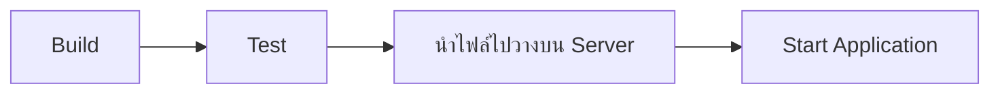

ก่อนที่เราจะไปพูดถึง CI/CD และ Jenkins เรามาดูปัญหาที่มักเกิดขึ้นในการพัฒนา Software กันก่อน

เมื่อเราพัฒนา Software เสร็จแล้ว ขั้นตอนต่อไปคือการนำ Software ไป Deploy บน Server ซึ่งโดยทั่วไปอาจมีหลายขั้นตอน เช่น

ถ้าเราต้องทำขั้นตอนเหล่านี้ด้วยตัวเองทุกครั้ง นอกจากจะเสียเวลาแล้ว ยังมีโอกาสเกิด Human Error เช่น Build ผิด Version, ลืม Run Test

และเมื่อทีมมีการแก้ไขและ Deploy Software บ่อยขึ้น กระบวนการ Deploy ก็อาจเริ่มกลายเป็น คอขวดของการพัฒนา Software

จะสังเกตุว่ากระบวนการเหล่านี้เป็นงานที่เราต้องทำซ้ำๆ แทบทุกครั้ง ไม่ว่าเราจะ release software กี่เวอร์ชั่นก็ตาม ถ้าเราสามารถทำให้ขั้นตอนเหล่านี้เป็น automate ได้ก็คงดีนะ

## CI (Continuos Integration)

