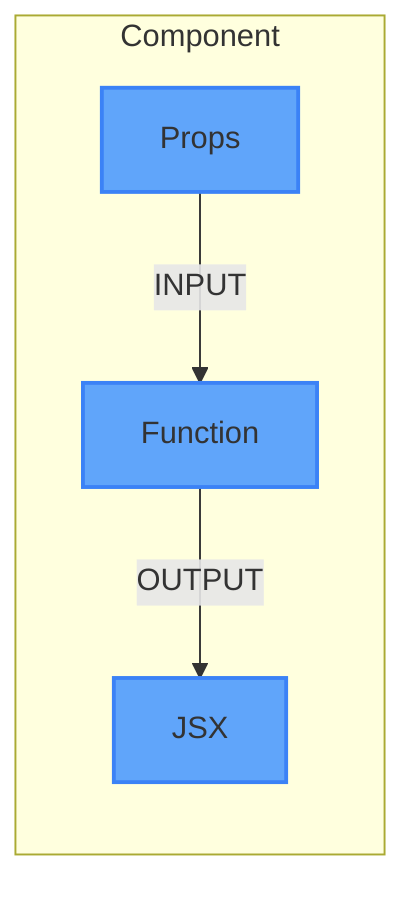
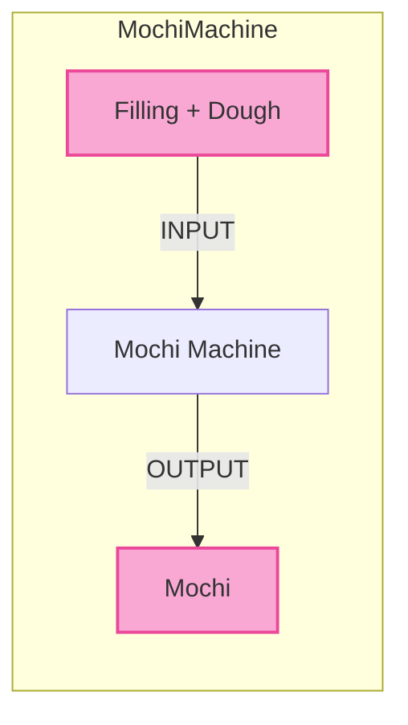

import ChatMessage from "@/components/ChatMessage.astro"

## Component คืออะไร?

Component คือ **function ที่ return JSX** — ลองนึกภาพมันเหมือนกล่องที่:
- รับ **Input** → ข้อมูลที่ส่งเข้ามา (เรียกว่า **props**)
- ประมวลผล → ทำอะไรสักอย่าง
- ส่ง **Output** → JSX (UI ที่จะแสดงบนหน้าจอ)



> จริง ๆ แล้ว component ก็เป็นแค่ function ปกติ แต่มันจะ return สิ่งที่ React เข้าใจได้ (นั่นคือ JSX นั่นเอง)

### Component เหมือนเครื่องทำโมจิ



ลองนึกภาพ **เครื่องทำโมจิ** ที่:
- **ใส่วัตถุดิบเข้าไป** → ได้ **โมจิ** ออกมา

Component ก็เหมือนกัน:
- **ใส่ props (ข้อมูล) เข้าไป** → ได้ **UI (JSX)** ออกมา

```tsx
// เครื่องทำโมจิ
function Mochi({ flavor }) {
  // ใส่ flavor เข้าไป
  // ออกมาเป็นโมจิรสนั้น
  return <div className="mochi">{flavor} Mochi</div>
}
```

| เครื่องทำโมจิ | Component |
|--------------|-----------|
| แป้ง, ไส้ | Props (ข้อมูลที่ส่งเข้าไป) |
| เครื่องจักร | Function ที่เขียน logic |
| โมจิ | JSX (UI ที่แสดงบนหน้าจอ) |

### ทำไมต้องใช้ Component?

ลองนึกภาพถ้าคุณต้องเขียนปุ่ม 10 ปุ่มที่หน้าตาเหมือนกัน — ถ้าเขียนทุกอย่างในไฟล์เดียว มันจะยาวมาก แต่ถ้าสร้าง component ชื่อ `Button` ขึ้นมา คุณก็แค่เรียก `<Button />` 10 ครั้ง เรียกว่า **reusability** นั่นเอง

เหตุการณ์สมมุติของคนที่ไม่ใช้ Component
<ChatMessage message="เปลี่ยนสีปุ่มใหม่หมดเลย!" avatarKey="me" isFromMe/>
<ChatMessage message="แง! ปุ่มมี 10 ตัวเลยนะ ต้องไปนั่งแก้ทีละไฟล์เลยเหรอ? T_T" avatarKey="blackCat" />

เหตุการณ์สมมุติของคนที่ใช้ Component
<ChatMessage message="เปลี่ยนสีปุ่มใหม่หมดเลย!" avatarKey="me" isFromMe />
<ChatMessage message="ได้เลย~ ปุ่มทั้ง 10 ตัวใช้ component เดียวกันอยู่ แก้แค่ไฟล์เดียวจบเลย สบายมาก! 😎" avatarKey="whiteCat" />

---

## Arrow Function Component

นอกจาก function declaration แบบปกติ ยังเขียนเป็น arrow function ได้อีกด้วย:

```tsx
const Header = () => {
  return <header><h1>My Site</h1></header>
}

export default Header
```

---

## กฎของ Component

React มีกฎ 3 ข้อที่ต้องจำ:

### 1. ชื่อต้องขึ้นต้นด้วยตัวใหญ่

```tsx
function App() {}   // ✅ ถูกต้อง
function app() {}   // ❌ React จะไม่รู้จัก
```

```tsx
<App />   // ✅ ใช้ได้
<app />   // ❌ ใช้ไม่ได้
```

### 2. ต้อง return อะไรสักอย่าง

Component ต้อง return JSX (หรือ `null` ถ้าต้องการซ่อน):

```tsx
function Valid() {
  return <div>Hello</div>
}

function AlsoValid() {
  return null  // ไม่แสดงอะไรเลย
}

function Invalid() {
  // ❌ ไม่ return อะไรเลย — Error!
}
```

### 3. ต้องมี single root element

JSX ที่ return ต้องมี **element เดียว** เป็น parent:

```tsx
// ❌ ผิด — มี 2 element หลัก
function Wrong() {
  return (
    <h1>Title</h1>
    <p>Description</p>
  )
}

// ✅ ถูก — wrap ด้วย div
function Correct() {
  return (
    <div>
      <h1>Title</h1>
      <p>Description</p>
    </div>
  )
}
```

---

## Fragment — ไม่ต้อง Wrap ด้วย div

ถ้าไม่อยากใช้ `<div>` เป็น parent (เพราะอาจทำให้โครงสร้าง HTML มี div ล้นมาก) สามารถใช้ **Fragment** แทนได้:

```tsx
function Article() {
  return (
    <>
      <h1>Title</h1>
      <p>Description</p>
    </>
  )
}
```

`<>` เป็น shorthand ของ `<React.Fragment>` — มันจะไม่สร้าง element จริง ๆ ใน DOM (ช่วยลด DOM nodes ที่ไม่จำเป็น)

```tsx
// เขียนแบบเต็มก็ได้
function Article() {
  return (
    <React.Fragment>
      <h1>Title</h1>
      <p>Description</p>
    </React.Fragment>
  )
}
```

<ChatMessage message="ใช้ Fragment แทน div เสมอ ๆ ก็ได้นะ แต่ถ้าต้องการ style ที่ element นั้นก็ต้องใช้ div อยู่ดี" avatarKey="whiteCat" />

---

## ตัวอย่าง: สร้าง Component หลายตัว

ลองสร้าง component 3 ตัว แล้วเรียกใช้งานใน App:

```tsx
// src/Header.tsx
function Header() {
  return (
    <header>
      <h1>My Website</h1>
    </header>
  );
}

export default Header;
```

```tsx
// src/Content.tsx
function Content() {
  return (
    <main>
      <p>ยินดีต้อนรับสู่เว็บไซต์ของเรา!</p>
    </main>
  );
}

export default Content;
```

```tsx
// src/Footer.tsx
function Footer() {
  return (
    <footer>
      <p>© 2024 My Website</p>
    </footer>
  );
}

export default Footer;
```

```tsx
// src/App.tsx
import Header from "./Header";
import Content from "./Content";
import Footer from "./Footer";

function App() {
  return (
    <>
      <Header />
      <Content />
      <Footer />
    </>
  );
}

export default App;
```

จะเห็นว่าใน `App` เราเรียก `<Header />`, `<Content />`, `<Footer />` ได้เลย — นี่คือพลังของ component: **เขียนครั้งเดียว ใช้ได้หลายที่**

<ChatMessage message="ลองสร้าง component ของตัวเองขึ้นมาดูสิ" avatarKey="whiteCat" />

import { Quiz } from "@/components/quiz"

<Quiz client:load
  quiz={{
    id: "components-basics",
    title: "Quiz: Component พื้นฐาน",
    questions: [
      {
        id: "q1",
        type: "single",
        question: "Component ใน React คืออะไร?",
        options: ["function ที่ return HTML ปกติ", "function ที่ return JSX", "class ที่ return CSS", "object ที่ return string"],
        correctAnswer: "function ที่ return JSX"
      },
      {
        id: "q2",
        type: "single",
        question: "ข้อใดเป็นกฎของ React Component?",
        options: ["ชื่อขึ้นต้นด้วยตัวเล็ก", "ต้อง return อะไรสักอย่าง", "ต้องมีหลาย root element", "ชื่อต้องเป็นคำสกลัด"],
        correctAnswer: "ต้อง return อะไรสักอย่าง"
      },
      {
        id: "q3",
        type: "single",
        question: "Fragment (<>...</>) ใช้ทำอะไร?",
        options: ["สร้าง style ใหม่", "wrap element โดยไม่สร้าง DOM node จริง", "สร้าง state ใหม่", "เปลี่ยนชื่อ component"],
        correctAnswer: "wrap element โดยไม่สร้าง DOM node จริง"
      },
      {
        id: "q4",
        type: "single",
        question: "ถ้าเขียน component เป็น arrow function ต้องเขียนอย่างไร?",
        options: ["const MyComponent = () => { return <div>Hi</div> }", "const MyComponent = () => <div>Hi</div>", "const MyComponent => <div>Hi</div>", "function => <div>Hi</div>"],
        correctAnswer: "const MyComponent = () => { return <div>Hi</div> }"
      },
      {
        id: "q5",
        type: "single",
        question: "Component สามารถ return null ได้หรือไม่?",
        options: ["ได้ เพราะจะซ่อน component นั้น", "ไม่ได้ จะเกิด error", "ได้เฉพาะใน class component", "ได้เฉพาะเมื่อใช้ useState"],
        correctAnswer: "ได้ เพราะจะซ่อน component นั้น"
      }
    ]
  }}
/>

