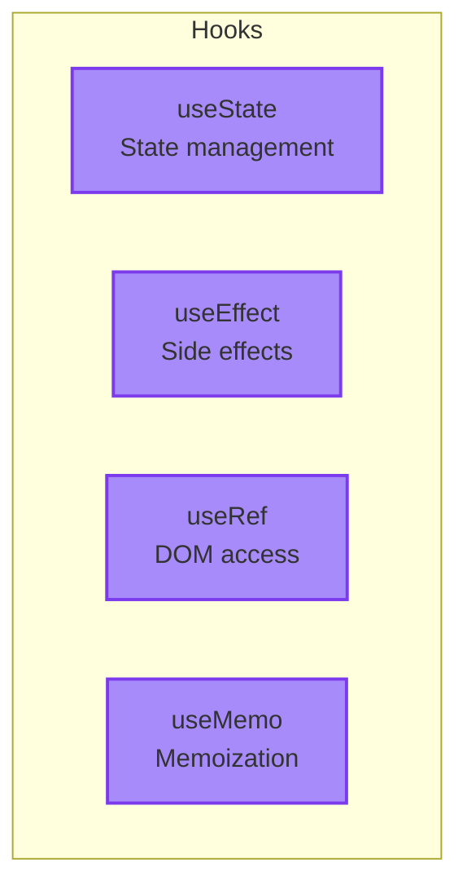
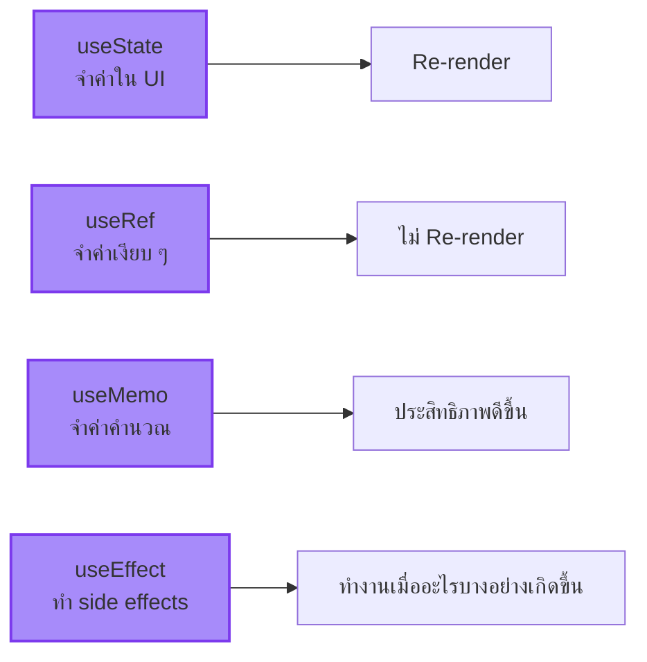

import ChatMessage from "@/components/ChatMessage.astro"

## Hooks คืออะไร?

Hook คือ **function พิเศษ** ที่ให้คุณ "ต่อ" กับ React features ต่าง ๆ เช่น state, lifecycle, refs



<ChatMessage message="ทุก Hook ขึ้นต้นด้วย 'use' — เป็น convention ของ React เลยนะ" avatarKey="whiteCat" />

---

## useState — ยังจำได้ไหม?

ถ้ายังจำได้จากบทก่อน ๆ `useState` ใช้เก็บ state ของ component:

```tsx
import { useState } from "react"

function Counter() {
  const [count, setCount] = useState(0)
  
  return (
    <button onClick={() => setCount(count + 1)}>
      Clicked {count} times
    </button>
  )
}
```

`useState` ให้เรา **จำ** ค่าบางอย่างไว้ตลอดการ render — ถ้าไม่มีมัน count จะ reset กลับเป็น 0 ทุกครั้งที่ render

<ChatMessage message="นึกถึง useState เหมือนตัวแปรที่ React คอยจำให้ ไม่ให้มันหายไปตอน re-render" avatarKey="whiteCat" />

---

## เปรียบเทียบ Hooks

| Hook | ใช้เก็บ | Re-render เมื่อ |
|------|---------|-----------------|
| `useState` | ค่าที่แสดงใน UI | ค่าเปลี่ยน |
| `useRef` | ค่าที่ไม่แสดงใน UI | ไม่ re-render |
| `useMemo` | ค่าที่คำนวณแล้ว | dependency เปลี่ยน |
| `useEffect` | ทำ side effects | dependency เปลี่ยน |

---

## สรุป



- **useState** — เก็บค่าและ re-render เมื่อค่าเปลี่ยน
- **useRef** — เก็บค่าโดยไม่ re-render (เหมาะกับ DOM refs)
- **useMemo** — จำค่าที่คำนวณแล้ว เพื่อประสิทธิภาพ
- **useEffect** — ทำงานเมื่อ state/props เปลี่ยน อย่าลืม cleanup!

<ChatMessage message="ฝึกใช้ Hooks ทั้ง 4 ตัวให้คล่องแคล่ว แล้วไปบทต่อไปกันเลย!" avatarKey="whiteCat" />

---

## 🎯 ต่อไป

[03. Context & State](./03-context-state) — เรียนรู้วิธีส่ง state ข้าม component โดยไม่ต้องส่ง props ผ่านทุกตัว

import { Quiz } from "@/components/quiz"

<Quiz client:load
  quiz={{
    id: "hooks-basics",
    title: "Quiz: Hooks พื้นฐาน",
    questions: [
      {
        id: "q1",
        type: "single",
        question: "useEffect ทำงานเมื่อไหร่?",
        options: ["ก่อน render", "ระหว่าง render", "หลัง render เสร็จ", "ตอน unmount เท่านั้น"],
        correctAnswer: "หลัง render เสร็จ"
      },
      {
        id: "q2",
        type: "single",
        question: "ถ้าไม่ทำ cleanup ใน useEffect จะเกิดอะไรขึ้น?",
        options: ["ไม่เกิดอะไร", "Memory Leak", "Error ทันที", "Component จะหายไป"],
        correctAnswer: "Memory Leak"
      },
      {
        id: "q3",
        type: "single",
        question: "useRef ต่างจาก useState อย่างไร?",
        options: ["useRef เก็บได้มากกว่า", "useRef ไม่ทำให้ re-render", "useState เร็วกว่า", "ไม่ต่างกัน"],
        correctAnswer: "useRef ไม่ทำให้ re-render"
      },
      {
        id: "q4",
        type: "single",
        question: "useMemo ใช้ทำอะไร?",
        options: ["เก็บ state", "เข้าถึง DOM", "จำค่าที่คำนวณแล้ว", "ทำ side effects"],
        correctAnswer: "จำค่าที่คำนวณแล้ว"
      },
      {
        id: "q5",
        type: "single",
        question: "empty dependency array [] ใน useEffect หมายความว่าอะไร?",
        options: ["ไม่เคย run", "run ทุกครั้ง", "run ครั้งเดียวตอน mount", "run ตอน unmount"],
        correctAnswer: "run ครั้งเดียวตอน mount"
      }
    ]
  }}
/>