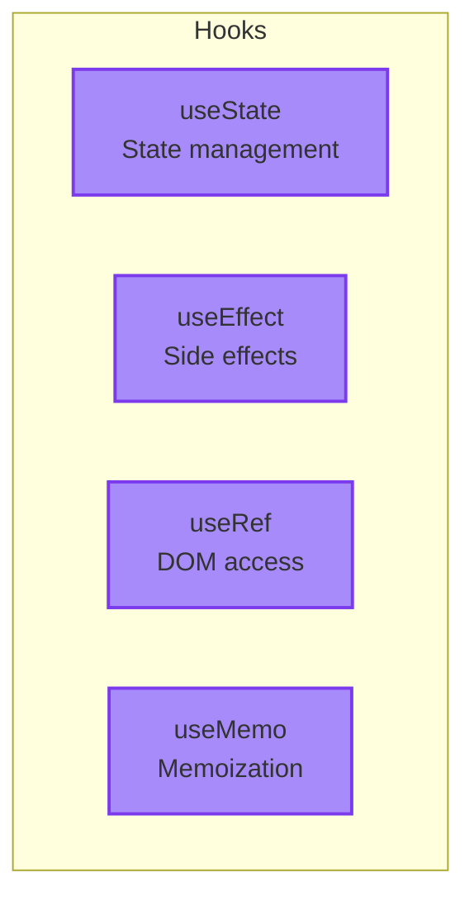

import ChatMessage from "@/components/ChatMessage.astro"

## Hooks คืออะไร?

Hook คือ **function พิเศษ** ที่ให้คุณ "ต่อ" กับ React features ต่าง ๆ เช่น state, lifecycle, refs

<ChatMessage message="ทุก Hook ขึ้นต้นด้วย 'use' — เป็น convention ของ React เลยนะ" avatarKey="whiteCat" />

---