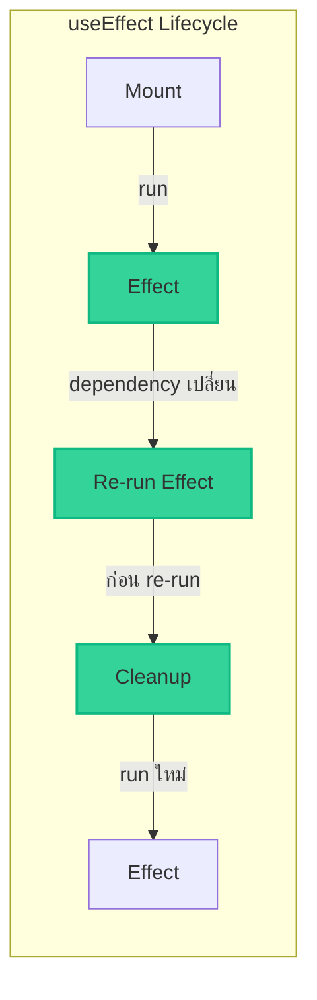
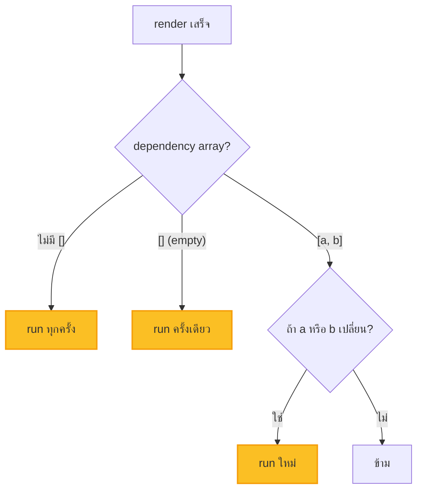

import ChatMessage from "@/components/ChatMessage.astro"

## useEffect — ทำงานเมื่อมีอะไรบางอย่างเกิดขึ้น

`useEffect` ใช้ทำ **side effects** — งานที่เกิดขึ้น "ข้างเคียง" การ render เช่น:
- เริ่มต้น timer
- ดึงข้อมูลจาก API
- แก้ไข DOM โดยตรง
- ตั้ง event listeners

### รูปแบบการใช้

```tsx
useEffect(() => {
  // ทำงานตอน mount (และทุกครั้งที่ dependency เปลี่ยน)
  return () => {
    // cleanup ตอน unmount (หรือก่อน run ใหม่)
  }
}, [dependencies]) // array ของ dependency
```



---

## ตัวอย่าง: Timer ด้วย useEffect

ลองทำ counter ที่นับเวลาอัตโนมัติ:

```tsx
import { useState, useEffect } from "react"

function TimerCounter() {
  const [count, setCount] = useState(0)
  
  useEffect(() => {
    // สร้าง interval ทุก 1 วินาที
    const timer = setInterval(() => {
      setCount(c => c + 1)
    }, 1000)
    
    // ❌ ถ้าไม่มี cleanup — timer จะทำงานต่อไปเรื่อย ๆ แม้ unmount แล้ว!
    
    // ✅ cleanup: ลบ interval เมื่อ component ถูกทำลาย
    return () => clearInterval(timer)
  }, []) // empty array = run ครั้งเดียวตอน mount
  
  return <div>Count: {count}</div>
}
```

### เปรียบเทียบ: มี vs ไม่มี cleanup

```tsx
// ❌ ไม่มี cleanup — Memory Leak!
function BadTimer() {
  const [count, setCount] = useState(0)
  
  useEffect(() => {
    const timer = setInterval(() => {
      setCount(c => c + 1)
    }, 1000)
    // ไม่ return cleanup!
  }, [])
  
  return <div>{count}</div>
}

// ✅ มี cleanup — ปลอดภัย!
function GoodTimer() {
  const [count, setCount] = useState(0)
  
  useEffect(() => {
    const timer = setInterval(() => {
      setCount(c => c + 1)
    }, 1000)
    
    return () => clearInterval(timer)
  }, [])
  
  return <div>{count}</div>
}
```

---

## Dependency Array — เมื่อไหร่ควร run?

```tsx
useEffect(() => {
  // 1. ไม่มี dependency → run ทุกครั้ง
}, ) 

useEffect(() => {
  // 2. empty array → run ครั้งเดียวตอน mount
}, [])

useEffect(() => {
  // 3. มี dependency → run เมื่อค่าใน array เปลี่ยน
}, [count, name])
```



### ตัวอย่าง: เปลี่ยน title ตาม count

```tsx
import { useEffect, useState } from "react"

function TitleUpdater() {
  const [count, setCount] = useState(0)
  
  useEffect(() => {
    document.title = `Count: ${count}`
  }, [count]) // run ใหม่เมื่อ count เปลี่ยน
  
  return (
    <button onClick={() => setCount(c => c + 1)}>
      +1
    </button>
  )
}
```