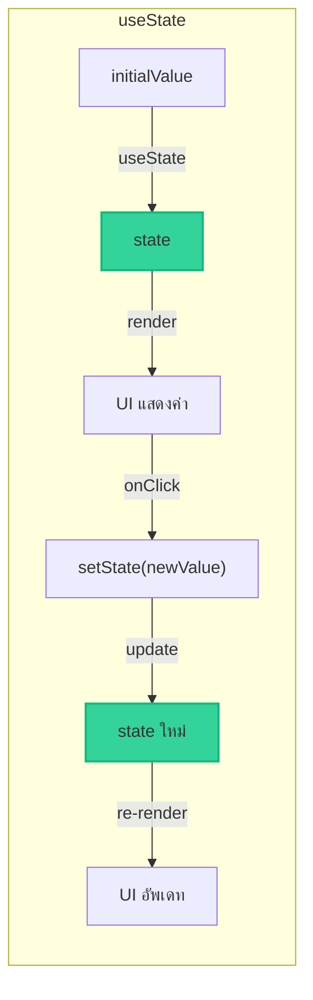
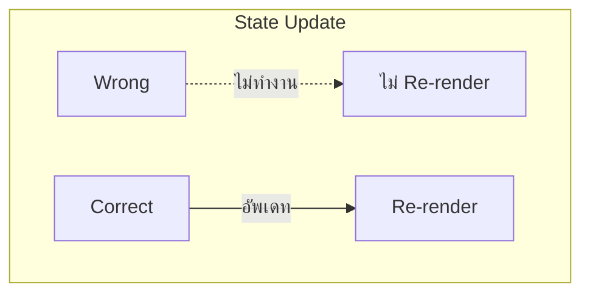

import ChatMessage from "@/components/ChatMessage.astro"

## useState — ยังจำค่าได้

`useState` ใช้ **จำ** ค่าบางอย่างไว้ใน component — ค่านี้จะคงอยู่ตลอดการ render

ถ้าไม่มี useState ทุกครั้งที่ re-render ค่าจะ reset กลับไปเหมือนเดิม!

### รูปแบบการใช้

```tsx
const [state, setState] = useState(initialValue)
```

- **state** — ค่าปัจจุบัน (read-only)
- **setState** — function สำหรับเปลี่ยนค่า
- **initialValue** — ค่าเริ่มต้น



---

## ตัวอย่าง: Counter

ลองทำ counter ง่าย ๆ:

```tsx
import { useState } from "react"

function Counter() {
  const [count, setCount] = useState(0)
  
  return (
    <div>
      <p>Count: {count}</p>
      <button onClick={() => setCount(count + 1)}>
        +1
      </button>
    </div>
  )
}
```

### อธิบาย

1. `useState(0)` — เริ่มต้น count = 0
2. `{count}` — แสดงค่าใน UI
3. `setCount(count + 1)` — เมื่อคลิก เปลี่ยนค่าเป็น count + 1
4. React จะ **re-render** และแสดงค่าใหม่

<ChatMessage message="สังเกตว่าเราใช้ setCount(count + 1) ไม่ใช่ count++ เพราะ state เปลี่ยนค่าไม่ได้โดยตรง!" avatarKey="whiteCat" />

---

## ตัวอย่าง: Form พื้นฐาน

ใช้ useState กับ input:

```tsx
function SimpleForm() {
  const [name, setName] = useState("")
  
  return (
    <div>
      <input 
        type="text" 
        value={name}
        onChange={(e) => setName(e.target.value)}
      />
      <p>สวัสดี: {name}</p>
    </div>
  )
}
```

---

## การอัพเดท State — สำคัญ!

### ❌ ไม่ถูกต้อง

```tsx
// ผิด! ไม่สามารถเปลี่ยน state โดยตรง
count = count + 1
```

### ✅ ถูกต้อง

```tsx
// ถูกต้อง ใช้ setter
setCount(count + 1)

// หรือใช้ function form (ดีกว่าเมื่อค่าขึ้นกับค่าเดิม)
setCount(c => c + 1)
```



<ChatMessage message="ใช้ setCount(c => c + 1) แทน setCount(count + 1) ทุกครั้ง เพื่อหลีกเลี่ยง stale closure!" avatarKey="whiteCat" />

---

## State หลายตัว

หลาย state ใน component:

```tsx
function MultipleStates() {
  const [name, setName] = useState("")
  const [age, setAge] = useState(0)
  const [isActive, setIsActive] = useState(false)
  
  // ...
}
```

---

## Object State

```tsx
function UserProfile() {
  const [user, setUser] = useState({
    name: "",
    email: "",
    age: 0
  })
  
  return (
    <div>
      <input 
        value={user.name}
        onChange={(e) => setUser({ ...user, name: e.target.value })}
      />
    </div>
  )
}
```

<ChatMessage message="เมื่ออัพเดท object state ต้อง spread (...) ค่าเดิมก่อน ไม่งั้นค่าอื่นจะหาย!" avatarKey="whiteCat" />

---

## 🎯 สรุป

- **useState(initial)** — สร้าง state ที่ React จะจำ
- **setState(newValue)** — อัพเดทค่า และ trigger re-render
- **setState(prev => ...)** — ใช้ function form เมื่ออัพเดทค่าขึ้นกับค่าเดิม
- **Spread operator (...)** — เมื่ออัพเดท object state