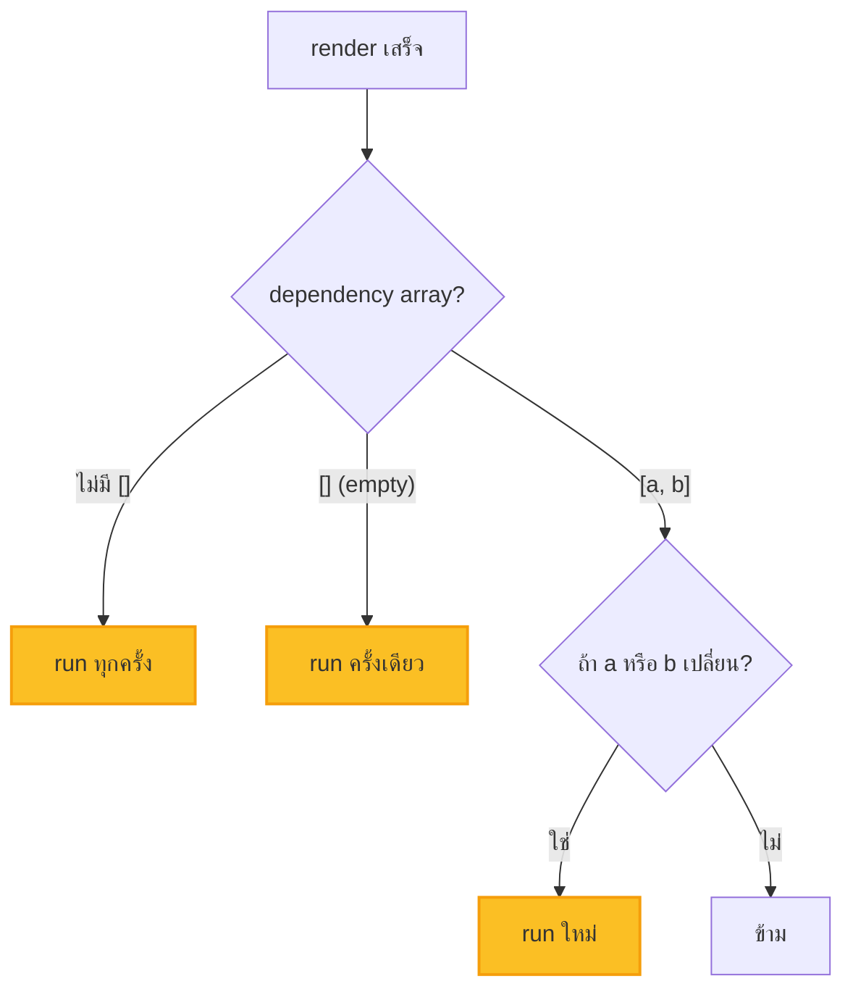
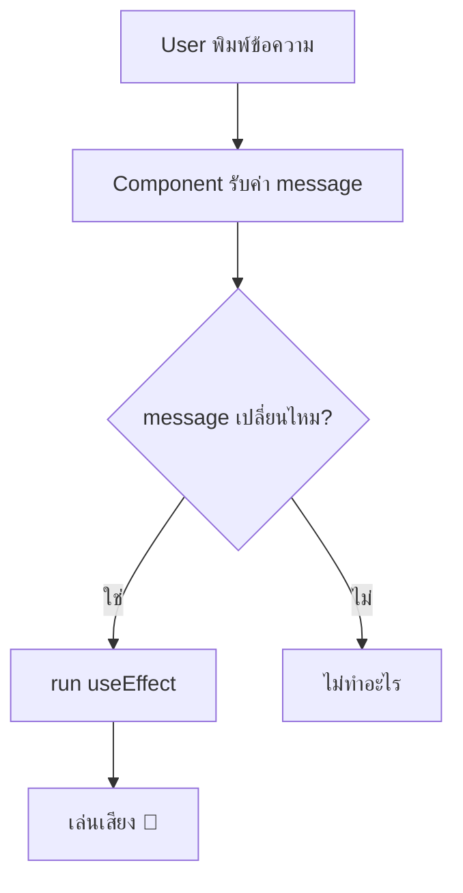
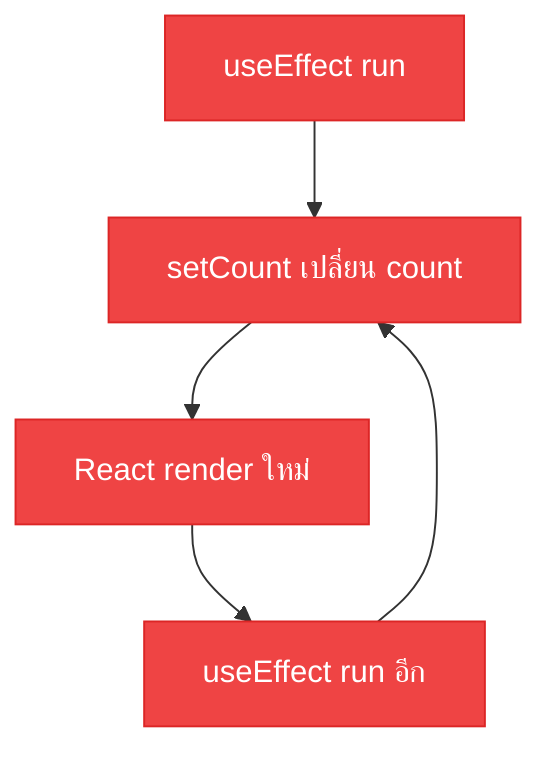

import ChatMessage from "@/components/ChatMessage.astro"

## useEffect — ทำงานเมื่อมีอะไรบางอย่างเกิดขึ้น

`useEffect` ใช้ทำ **side effects** — งานที่เกิดขึ้น "ข้างเคียง" การ render เช่น:
- เริ่มต้น timer
- ดึงข้อมูลจาก API
- แก้ไข DOM โดยตรง
- ตั้ง event listeners

### รูปแบบการใช้

```tsx
useEffect(() => {
  // ทำงานตอน mount (และทุกครั้งที่ dependency เปลี่ยน)
  return () => {
    // cleanup ตอน unmount (หรือก่อน run ใหม่)
  }
}, [dependencies]) // array ของ dependency
```

## Dependency Array — เมื่อไหร่ควร run?

```tsx
useEffect(() => {
  // 1. ไม่มี dependency → run ทุกครั้ง
}, ) 

useEffect(() => {
  // 2. empty array → run ครั้งเดียวตอน mount
}, [])

useEffect(() => {
  // 3. มี dependency → run เมื่อค่าใน array เปลี่ยน
}, [count, name])
```



---

### ตัวอย่าง: เปลี่ยน title ตาม count

```tsx
import { useEffect, useState } from "react"

function TitleUpdater() {
  const [count, setCount] = useState(0)
  
  useEffect(() => {
    document.title = `Count: ${count}`
  }, [count]) // run ใหม่เมื่อ count เปลี่ยน
  
  return (
    <button onClick={() => setCount(c => c + 1)}>
      +1
    </button>
  )
}
```

### ตัวอย่าง: เรียก function เมื่อ state เปลี่ยน

```tsx
function ChatApp() {
  const [message, setMessage] = useState("")
  
  useEffect(() => {
    if (message) {
      playSound() // เล่นเสียงเมื่อมี message ใหม่
    }
  }, [message]) // run ใหม่เมื่อ message เปลี่ยน
  
  return (
    <input 
      value={message} 
      onChange={e => setMessage(e.target.value)} 
    />
  )
}
```



---

## ตัวอย่าง: Timer ด้วย useEffect

ลองทำ counter ที่นับเวลาอัตโนมัติ:

```tsx
import { useState, useEffect } from "react"

function TimerCounter() {
  const [count, setCount] = useState(0)
  
  useEffect(() => {
    // สร้าง interval ทุก 1 วินาที
    const timer = setInterval(() => {
      setCount(c => c + 1)
    }, 1000)
    
    // ❌ ถ้าไม่มี cleanup — timer จะทำงานต่อไปเรื่อย ๆ แม้ unmount แล้ว!
    
    // ✅ cleanup: ลบ interval เมื่อ component ถูกทำลาย
    return () => clearInterval(timer)
  }, []) // empty array = run ครั้งเดียวตอน mount
  
  return <div>Count: {count}</div>
}
```

### เปรียบเทียบ: มี vs ไม่มี cleanup

```tsx
// ❌ ไม่มี cleanup — Memory Leak!
function BadTimer() {
  const [count, setCount] = useState(0)
  
  useEffect(() => {
    const timer = setInterval(() => {
      setCount(c => c + 1)
    }, 1000)
    // ไม่ return cleanup!
  }, [])
  
  return <div>{count}</div>
}

// ✅ มี cleanup — ปลอดภัย!
function GoodTimer() {
  const [count, setCount] = useState(0)
  
  useEffect(() => {
    const timer = setInterval(() => {
      setCount(c => c + 1)
    }, 1000)
    
    return () => clearInterval(timer)
  }, [])
  
  return <div>{count}</div>
}
```

---

## ⚠️ Pitfall: Infinity Loop

<ChatMessage
  avatarKey="blackCat"
  message="ถ้าใช้useEffect แล้วใส่ dependency เป็น field เดียวกับที่ setState ใน use effect จะเจอ loop นรกไม่รู้จบ ระวังด้วยหล่ะ"
/>

### สาเหตุ: ใส่ state ใน dependency แล้วเปลี่ยนมันใน effect

```tsx
// ❌ Infinity Loop! — อย่าทำแบบนี้!
function BadCounter() {
  const [count, setCount] = useState(0)
  
  useEffect(() => {
    setCount(count + 1) // เปลี่ยน count → render ใหม่ → run effect อีก → เปลี่ยน count อีก → ...
  }, [count]) // เพิ่ม count ใน dependency = ตายตัว!
  
  return <div>{count}</div>
}
```

**เกิดอะไรขึ้น:**
1. `useEffect` run เพราะ `count` อยู่ใน dependency
2. `setCount(count + 1)` เปลี่ยน `count`
3. React render ใหม่
4. `useEffect` run อีก... วนไปเรื่อยๆ 🔄



### แก้ไข: ใช้ functional update

```tsx
// ✅ ปลอดภัย! — ใช้ functional update
function GoodCounter() {
  const [count, setCount] = useState(0)
  
  useEffect(() => {
    // ใช้ function แทนการอ่านค่า directly
    setCount(c => c + 1)
  }, []) // ไม่มี dependency ที่เปลี่ยนใน effect!
  
  return <div>{count}</div>
}

// หรือถ้าต้องการ run เมื่อบางอย่างเปลี่ยน
function CounterWithTrigger() {
  const [count, setCount] = useState(0)
  const [trigger, setTrigger] = useState(0)
  
  useEffect(() => {
    setCount(c => c + 1)
  }, [trigger]) // trigger เปลี่ยน → run แค่ครั้งเดียว
  
  return (
    <div>
      <p>Count: {count}</p>
      <button onClick={() => setTrigger(t => t + 1)}>
        +1 Trigger
      </button>
    </div>
  )
}
```

### อีกกรณี: fetch แล้ว setState ใส่ dependency

```tsx
// ❌ Infinity Loop!
function BadFetch() {
  const [data, setData] = useState(null)
  
  useEffect(() => {
    fetch('/api/data')
      .then(res => res.json())
      .then(result => {
        setData(result) // เปลี่ยน data → effect run อีก!
      })
  }, [data]) // เปลี่ยน data ใน dependency = วนตลอด!
}

// ✅ แก้ไข: ใส่ empty array หรือใช้ flag
function GoodFetch() {
  const [data, setData] = useState(null)
  
  useEffect(() => {
    let mounted = true
    
    fetch('/api/data')
      .then(res => res.json())
      .then(result => {
        if (mounted) setData(result)
      })
      
    return () => { mounted = false }
  }, []) // run ครั้งเดียวตอน mount
  
  return <div>{data}</div>
}
```

<ChatMessage
  avatarKey="blackCat"
  message="จำไว้นะ ถ้าเจ้าใส่ state ใน dependency แล้วเปลี่ยน state นั้นใน effect = infinity loop แน่นอน! ใช้ `setCount(c => c + 1)` แทน `setCount(count + 1)` เสมอ หรือใส่ empty array `[]` แล้วใช้ cleanup เป็น flag ควบคุม"
/>