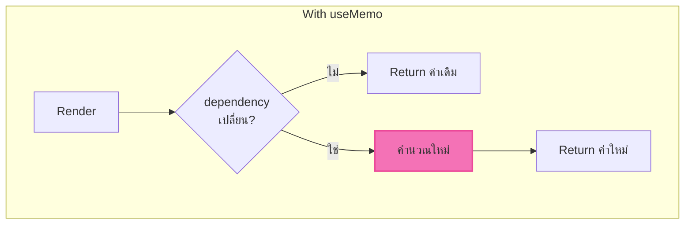

import ChatMessage from "@/components/ChatMessage.astro"

## useMemo — จำค่าที่คำนวณแล้ว

`useMemo` ใช้ **จำ** ค่าที่คำนวณไว้ เพื่อไม่ต้องคำนวณใหม่ทุก render

### ปัญหา: คำนวณซ้ำทุก render

```tsx
import { useState } from "react"

function ExpensiveComponent() {
  const [count, setCount] = useState(0)
  
  // ❌ ฟังก์ชันนี้จะทำงานทุกครั้งที่ render
  // แม้ว่า `count` จะไม่เปลี่ยน
  function expensiveCalculation() {
    console.log("Calculating...")
    let result = 0
    for (let i = 0; i < 1000000; i++) {
      result += i
    }
    return result
  }
  
  const result = expensiveCalculation()
  
  return (
    <div>
      <p>Result: {result}</p>
      <p>Count: {count}</p>
      <button onClick={() => setCount(c => c + 1)}>+1</button>
    </div>
  )
}
```

### แก้ด้วย useMemo

```tsx
import { useState, useMemo } from "react"

function MemoizedComponent() {
  const [count, setCount] = useState(0)
  
  // ✅ คำนวณเฉพาะเมื่อ count เปลี่ยนเท่านั้น
  const result = useMemo(() => {
    console.log("Calculating...")
    let res = 0
    for (let i = 0; i < 1000000; i++) {
      res += i
    }
    return res
  }, [count]) // dependency array
  
  return (
    <div>
      <p>Result: {result}</p>
      <p>Count: {count}</p>
      <button onClick={() => setCount(c => c + 1)}>+1</button>
    </div>
  )
}
```



<ChatMessage message="useMemo ใช้กับการคำนวณที่หนัก ๆ หรือ object/array ที่สร้างใหม่ทุก render" avatarKey="whiteCat" />

### ตัวอย่าง: Memoize object

```tsx
import { useState, useMemo } from "react"

function UserProfile() {
  const [name, setName] = useState("")
  const [age, setAge] = useState(0)
  
  // ❌ object ใหม่ทุก render → ทำให้ child re-render
  const user = { name, age }
  
  // ✅ สร้าง object ใหม่เฉพาะเมื่อ name หรือ age เปลี่ยน
  const userMemoized = useMemo(() => ({ name, age }), [name, age])
  
  return (
    <div>
      <input value={name} onChange={e => setName(e.target.value)} />
      <input value={age} onChange={e => setAge(+e.target.value)} />
    </div>
  )
}
```

---

## สรุป useMemo vs useRef

| Hook | ใช้เก็บ | Re-render เมื่อ |
|------|---------|-----------------|
| `useMemo` | ค่าที่คำนวณแล้ว | dependency เปลี่ยน |
| `useRef` | ค่าที่ไม่แสดงใน UI | ไม่ re-render |