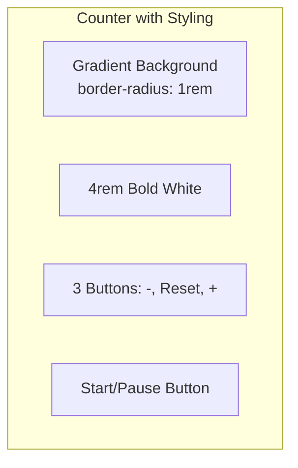

import ChatMessage from "@/components/ChatMessage.astro"

## Styling — ตกแต่ง Counter ให้สวย

ตอนนี้เรามี Counter แล้ว แต่มันยังไม่สวย ลองมาตกแต่งกัน!

### CSS Modules (แนะนำ)

สร้างไฟล์ `Counter.module.css`:

```css
.container {
  display: flex;
  flex-direction: column;
  align-items: center;
  gap: 1rem;
  padding: 2rem;
  background: linear-gradient(135deg, #667eea 0%, #764ba2 100%);
  border-radius: 1rem;
  box-shadow: 0 10px 40px rgba(102, 126, 234, 0.4);
}

.countDisplay {
  font-size: 4rem;
  font-weight: bold;
  color: white;
  text-shadow: 0 2px 10px rgba(0, 0, 0, 0.2);
}

.buttonGroup {
  display: flex;
  gap: 0.5rem;
}

.button {
  padding: 0.75rem 1.5rem;
  font-size: 1.25rem;
  font-weight: 600;
  border: none;
  border-radius: 0.5rem;
  cursor: pointer;
  transition: all 0.2s ease;
  background: white;
  color: #667eea;
}

.button:hover {
  transform: translateY(-2px);
  box-shadow: 0 5px 20px rgba(0, 0, 0, 0.2);
}

.button:active {
  transform: translateY(0);
}

.button.danger {
  background: #ef4444;
  color: white;
}

.button.success {
  background: #22c55e;
  color: white;
}
```

ใช้ใน component:

```tsx
// src/Counter.tsx
import { useState, useEffect, useRef } from "react"
import styles from "./Counter.module.css"

function Counter() {
  const [count, setCount] = useState(0)
  const [isTimerRunning, setIsTimerRunning] = useState(false)
  const timerRef = useRef(null)
  
  useEffect(() => {
    if (isTimerRunning) {
      timerRef.current = setInterval(() => {
        setCount(c => c + 1)
      }, 1000)
    }
    return () => {
      if (timerRef.current) {
        clearInterval(timerRef.current)
      }
    }
  }, [isTimerRunning])
  
  return (
    <div className={styles.container}>
      <div className={styles.countDisplay}>{count}</div>
      
      <div className={styles.buttonGroup}>
        <button 
          className={`${styles.button} ${styles.danger}`}
          onClick={() => setCount(c => c - 1)}
        >
          -
        </button>
        
        <button 
          className={styles.button}
          onClick={() => setCount(0)}
        >
          Reset
        </button>
        
        <button 
          className={`${styles.button} ${styles.success}`}
          onClick={() => setCount(c => c + 1)}
        >
          +
        </button>
      </div>
      
      <button 
        className={styles.button}
        onClick={() => setIsTimerRunning(!isTimerRunning)}
      >
        {isTimerRunning ? "⏸ Pause" : "▶️ Start"}
      </button>
    </div>
  )
}

export default Counter
```

### ผลลัพธ์



<ChatMessage message="CSS Modules ช่วยให้ style ไม่ชนกันระหว่าง component — ใช้คู่กับ React ได้ดีมาก!" avatarKey="whiteCat" />

### Inline Styles (ทางเลือก)

ถ้าไม่อยากสร้างไฟล์แยก:

```tsx
function InlineCounter() {
  const [count, setCount] = useState(0)
  
  const containerStyle = {
    display: "flex",
    flexDirection: "column",
    alignItems: "center",
    gap: "1rem",
    padding: "2rem",
    background: "linear-gradient(135deg, #667eea 0%, #764ba2 100%)",
    borderRadius: "1rem",
    color: "white",
  }
  
  return (
    <div style={containerStyle}>
      <h1 style={{ fontSize: "4rem", margin: 0 }}>{count}</h1>
      <div style={{ display: "flex", gap: "0.5rem" }}>
        <button onClick={() => setCount(c => c - 1)}>-</button>
        <button onClick={() => setCount(0)}>Reset</button>
        <button onClick={() => setCount(c => c + 1)}>+</button>
      </div>
    </div>
  )
}
```

<ChatMessage message="Inline styles เหมาะกับ style ที่เปลี่ยนแปลงตาม state แต่ไม่ควรใช้เยอะ เพราะอ่านยาก" avatarKey="blackCat" />