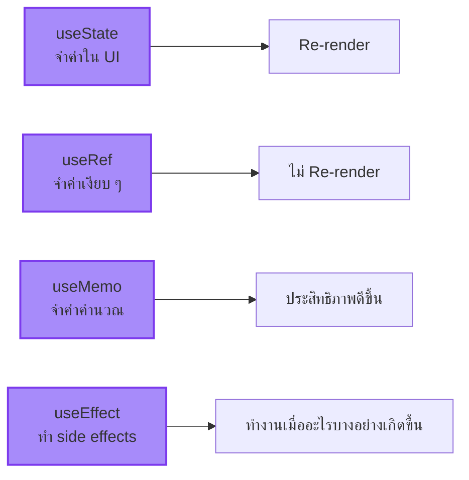

import ChatMessage from "@/components/ChatMessage.astro"

## สรุป

- **useState** — เก็บค่าและ re-render เมื่อค่าเปลี่ยน
- **useRef** — เก็บค่าโดยไม่ re-render (เหมาะกับ DOM refs)
- **useMemo** — จำค่าที่คำนวณแล้ว เพื่อประสิทธิภาพ
- **useEffect** — ทำงานเมื่อ state/props เปลี่ยน อย่าลืม cleanup!