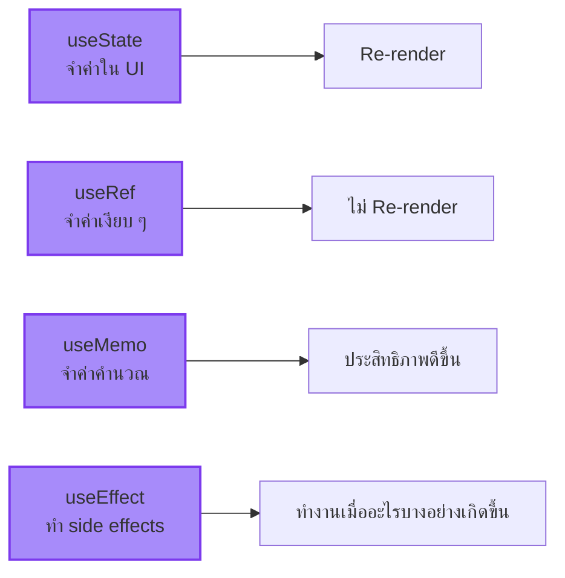

import ChatMessage from "@/components/ChatMessage.astro"
import { Quiz } from "@/components/quiz"

## สรุป

- **useState** — เก็บค่าและ re-render เมื่อค่าเปลี่ยน
- **useRef** — เก็บค่าโดยไม่ re-render (เหมาะกับ DOM refs)
- **useMemo** — จำค่าที่คำนวณแล้ว เพื่อประสิทธิภาพ
- **useEffect** — ทำงานเมื่อ state/props เปลี่ยน อย่าลืม cleanup!

<Quiz client:load
  quiz={{
    id: "hooks-basics",
    title: "Quiz: Hooks พื้นฐาน",
    questions: [
      {
        id: "q1",
        type: "single",
        question: "useEffect ทำงานเมื่อไหร่?",
        options: ["ก่อน render", "ระหว่าง render", "หลัง render เสร็จ", "ตอน unmount เท่านั้น"],
        correctAnswer: "หลัง render เสร็จ"
      },
      {
        id: "q2",
        type: "single",
        question: "ถ้าไม่ทำ cleanup ใน useEffect จะเกิดอะไรขึ้น?",
        options: ["ไม่เกิดอะไร", "Memory Leak", "Error ทันที", "Component จะหายไป"],
        correctAnswer: "Memory Leak"
      },
      {
        id: "q3",
        type: "single",
        question: "useRef ต่างจาก useState อย่างไร?",
        options: ["useRef เก็บได้มากกว่า", "useRef ไม่ทำให้ re-render", "useState เร็วกว่า", "ไม่ต่างกัน"],
        correctAnswer: "useRef ไม่ทำให้ re-render"
      },
      {
        id: "q4",
        type: "single",
        question: "useMemo ใช้ทำอะไร?",
        options: ["เก็บ state", "เข้าถึง DOM", "จำค่าที่คำนวณแล้ว", "ทำ side effects"],
        correctAnswer: "จำค่าที่คำนวณแล้ว"
      },
      {
        id: "q5",
        type: "single",
        question: "empty dependency array [] ใน useEffect หมายความว่าอะไร?",
        options: ["ไม่เคย run", "run ทุกครั้ง", "run ครั้งเดียวตอน mount", "run ตอน unmount"],
        correctAnswer: "run ครั้งเดียวตอน mount"
      }
    ]
  }}
/>