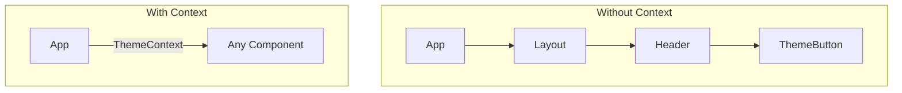
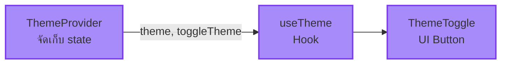

import ChatMessage from "@/components/ChatMessage.astro"

## Context API คืออะไร?

Context API เป็นวิธีที่ React มีให้สำหรับ **ส่ง data ข้าม component tree** โดยไม่ต้องส่ง props ผ่านทุกตัว



<ChatMessage message="ถ้าเปรียบกับการส่งข้อความทางไปรษณีย์ — Context คือกล่องแชร์ที่ทุกคนเข้าถึงได้" avatarKey="whiteCat" />

---

## สร้าง Theme Context

### Step 1: สร้าง Theme Context

```tsx
// src/contexts/ThemeContext.tsx
import { createContext, useContext, useState, useEffect, ReactNode } from "react"

type Theme = "light" | "dark"

interface ThemeContextType {
  theme: Theme
  toggleTheme: () => void
}

const ThemeContext = createContext<ThemeContextType | undefined>(undefined)

export function ThemeProvider({ children }: { children: ReactNode }) {
  const [theme, setTheme] = useState<Theme>(() => {
    // อ่านค่าจาก localStorage หรือ system preference
    if (typeof window !== "undefined") {
      const saved = localStorage.getItem("theme") as Theme
      if (saved) return saved
      return window.matchMedia("(prefers-color-scheme: dark)").matches ? "dark" : "light"
    }
    return "light"
  })

  useEffect(() => {
    // อัปเดต class ของ HTML element
    const root = document.documentElement
    if (theme === "dark") {
      root.classList.add("dark")
    } else {
      root.classList.remove("dark")
    }
    localStorage.setItem("theme", theme)
  }, [theme])

  const toggleTheme = () => {
    setTheme(prev => prev === "light" ? "dark" : "light")
  }

  return (
    <ThemeContext.Provider value={{ theme, toggleTheme }}>
      {children}
    </ThemeContext.Provider>
  )
}

export function useTheme() {
  const context = useContext(ThemeContext)
  if (!context) {
    throw new Error("useTheme must be used within a ThemeProvider")
  }
  return context
}
```

### Step 2: ใช้งาน ThemeProvider

```tsx
// src/main.tsx
import { ThemeProvider } from "./contexts/ThemeContext"

ReactDOM.createRoot(document.getElementById("root")!).render(
  <React.StrictMode>
    <ThemeProvider>
      <App />
    </ThemeProvider>
  </React.StrictMode>
)
```

### Step 3: สร้าง Theme Toggle Button

```tsx
// src/components/ThemeToggle.tsx
import { useTheme } from "../contexts/ThemeContext"

export function ThemeToggle() {
  const { theme, toggleTheme } = useTheme()

  return (
    <button
      onClick={toggleTheme}
      className="p-2 rounded-lg bg-gray-200 dark:bg-gray-700 hover:bg-gray-300 dark:hover:bg-gray-600 transition-colors"
      aria-label={`Switch to ${theme === "light" ? "dark" : "light"} mode`}
    >
      {theme === "light" ? "🌙" : "☀️"}
    </button>
  )
}
```

---

## ใช้งานใน Component ใดก็ได้

```tsx
// src/components/Header.tsx
import { ThemeToggle } from "./ThemeToggle"

export function Header() {
  return (
    <header className="flex justify-between items-center p-4 bg-white dark:bg-gray-800">
      <h1 className="text-xl font-bold dark:text-white">My Portfolio</h1>
      <ThemeToggle />
    </header>
  )
}
```

<ChatMessage message="ตอนนี้ theme จะถูกเก็บใน localStorage ด้วย คนเข้าชมจะเห็น theme ที่เลือกไว้ล่าสุดเสมอ" avatarKey="whiteCat" />

---

## 📝 สรุป

| สิ่งที่ทำ | คำอธิบาย |
|---------|---------|
| `createContext()` | สร้าง context object |
| `useContext()` | อ่านค่าจาก context |
| `Provider` | ส่งค่าให้ component ลูก |
| `useEffect` + `localStorage` | จำ theme ไว้ตลอด |



## 🎯 ต่อไป

[02. Zustand](./2-zustand) — เรียนรู้การใช้ Zustand สำหรับ cart store ที่มีประสิทธิภาพมากขึ้น

import { Quiz } from "@/components/quiz"

<Quiz client:load
  quiz={{
    id: "context-theme",
    title: "Quiz: Context API & Theme",
    questions: [
      {
        id: "q1",
        type: "single",
        question: "Context API ใช้แก้ปัญหาอะไร?",
        options: ["Props drilling", "Memory leak", "Re-render ไม่เสร็จ", "CSS พัง"],
        correctAnswer: "Props drilling"
      },
      {
        id: "q2",
        type: "single",
        question: "ThemeProvider ควรอยู่ตรงไหนใน component tree?",
        options: ["ลึกที่สุด", "รอบๆ App", "ใน Header", "ใน Button"],
        correctAnswer: "รอบๆ App"
      },
      {
        id: "q3",
        type: "single",
        question: "ถ้าเรียก useTheme นอก ThemeProvider จะเกิดอะไรขึ้น?",
        options: ["ไม่เกิดอะไร", "undefined", "Error", "Auto default"],
        correctAnswer: "Error"
      },
      {
        id: "q4",
        type: "single",
        question: "localStorage ใช้ทำอะไรในที่นี้?",
        options: ["เก็บ CSS", "จำ theme ที่เลือก", "เก็บ user", "Cache API"],
        correctAnswer: "จำ theme ที่เลือก"
      }
    ]
  }}
/>