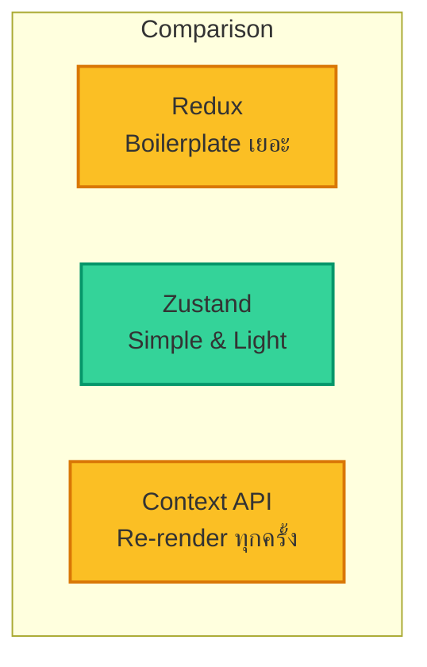
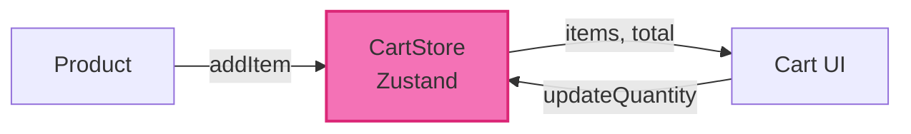

import ChatMessage from "@/components/ChatMessage.astro"

## ทำไมต้อง Zustand?

Zustand เป็น **state management library** ที่เล็กและเรียบง่าย ต่างจาก Redux ที่ต้องเขียน boilerplate เยอะ



<ChatMessage message="Zustand ใช้งานง่ายมาก — สร้าง store คล้าย ๆ การสร้าง object ธรรมดาเลย" avatarKey="whiteCat" />

---

## ติดตั้ง Zustand

```bash
npm install zustand
```

---

## สร้าง Cart Store

### Step 1: กำหนด Type ของ Product

```tsx
// src/types/product.ts
export interface Product {
  id: string
  name: string
  price: number
  image: string
}

export interface CartItem extends Product {
  quantity: number
}
```

### Step 2: สร้าง Cart Store

```tsx
// src/stores/cartStore.ts
import { create } from "zustand"
import { persist } from "zustand/middleware"
import { CartItem, Product } from "../types/product"

interface CartStore {
  items: CartItem[]
  addItem: (product: Product) => void
  removeItem: (productId: string) => void
  updateQuantity: (productId: string, quantity: number) => void
  clearCart: () => void
  getTotal: () => number
}

export const useCartStore = create<CartStore>()(
  persist(
    (set, get) => ({
      items: [],

      addItem: (product: Product) => {
        const items = get().items
        const existingItem = items.find(item => item.id === product.id)

        if (existingItem) {
          set({
            items: items.map(item =>
              item.id === product.id
                ? { ...item, quantity: item.quantity + 1 }
                : item
            )
          })
        } else {
          set({ items: [...items, { ...product, quantity: 1 }] })
        }
      },

      removeItem: (productId: string) => {
        set({ items: get().items.filter(item => item.id !== productId) })
      },

      updateQuantity: (productId: string, quantity: number) => {
        if (quantity <= 0) {
          get().removeItem(productId)
          return
        }
        set({
          items: get().items.map(item =>
            item.id === productId ? { ...item, quantity } : item
          )
        })
      },

      clearCart: () => set({ items: [] }),

      getTotal: () => {
        const items = get().items
        return items.reduce((total, item) => total + item.price * item.quantity, 0)
      }
    }),
    {
      name: "cart-storage" // ชื่อ key ใน localStorage
    }
  )
)
```

### Step 3: ใช้งาน Cart Store ใน Component

```tsx
// src/components/CartIcon.tsx
import { useCartStore } from "../stores/cartStore"

export function CartIcon() {
  const items = useCartStore(state => state.items)
  const itemCount = items.reduce((sum, item) => sum + item.quantity, 0)

  return (
    <div className="relative">
      <span className="text-2xl">🛒</span>
      {itemCount > 0 && (
        <span className="absolute -top-2 -right-2 bg-red-500 text-white text-xs rounded-full w-5 h-5 flex items-center justify-center">
          {itemCount}
        </span>
      )}
    </div>
  )
}
```

```tsx
// src/components/ProductCard.tsx
import { Product } from "../types/product"
import { useCartStore } from "../stores/cartStore"

interface ProductCardProps {
  product: Product
}

export function ProductCard({ product }: ProductCardProps) {
  const addItem = useCartStore(state => state.addItem)

  return (
    <div className="border rounded-lg p-4">
      
      <h3 className="font-semibold mt-2">{product.name}</h3>
      <p className="text-gray-600">${product.price}</p>
      <button
        onClick={() => addItem(product)}
        className="mt-2 w-full bg-blue-600 text-white py-2 rounded hover:bg-blue-700"
      >
        Add to Cart
      </button>
    </div>
  )
}
```

```tsx
// src/components/CartPage.tsx
import { useCartStore } from "../stores/cartStore"

export function CartPage() {
  const { items, removeItem, updateQuantity, clearCart, getTotal } = useCartStore()

  if (items.length === 0) {
    return <div className="text-center py-8">Your cart is empty</div>
  }

  return (
    <div className="max-w-2xl mx-auto">
      <h1 className="text-2xl font-bold mb-4">Shopping Cart</h1>
      
      {items.map(item => (
        <div key={item.id} className="flex items-center gap-4 border-b py-4">
          
          <div className="flex-1">
            <h3 className="font-semibold">{item.name}</h3>
            <p className="text-gray-600">${item.price} x {item.quantity}</p>
          </div>
          <div className="flex items-center gap-2">
            <button
              onClick={() => updateQuantity(item.id, item.quantity - 1)}
              className="px-2 py-1 bg-gray-200 rounded"
            >
              -
            </button>
            <span>{item.quantity}</span>
            <button
              onClick={() => updateQuantity(item.id, item.quantity + 1)}
              className="px-2 py-1 bg-gray-200 rounded"
            >
              +
            </button>
            <button
              onClick={() => removeItem(item.id)}
              className="ml-4 text-red-600 hover:text-red-700"
            >
              🗑️
            </button>
          </div>
        </div>
      ))}

      <div className="mt-4 text-right">
        <p className="text-xl font-bold">Total: ${getTotal()}</p>
        <button
          onClick={clearCart}
          className="mt-4 px-4 py-2 bg-red-600 text-white rounded hover:bg-red-700"
        >
          Clear Cart
        </button>
      </div>
    </div>
  )
}
```

---

## ทำไม Zustand ถึงดี?

| ฟีเจอร์ | Zustand | Redux | Context |
|--------|---------|-------|---------|
| Boilerplate | น้อย | เยอะ | ไม่มี |
| เลือกอ่าน state | ✅ | ✅ | ❌ |
| Middleware (persist) | ✅ | ✅ | ❌ |
| ขนาด | ~1KB | ใหญ่ |  Built-in |
| Performance | ดีมาก | ดี | เสี่ยง re-render |

<ChatMessage message="persist middleware ทำให้ cart จำค่าไว้ใน localStorage อัตโนมัติ ไม่ต้องเขียน useEffect เอง" avatarKey="whiteCat" />

---

## 📝 สรุป



- **`create()`** — สร้าง store
- **`persist()`** — เก็บใน localStorage อัตโนมัติ
- **`useCartStore()`** — hook สำหรับเข้าถึง state
- **Selector** — เลือกอ่านบางส่วนของ state ได้ เพื่อ performance

## 🎯 ต่อไป

[03. เชื่อม UI กับ State](./3-connect-ui) — นำทุกอย่างมารวมกัน

import { Quiz } from "@/components/quiz"

<Quiz client:load
  quiz={{
    id: "zustand-cart",
    title: "Quiz: Zustand Cart Store",
    questions: [
      {
        id: "q1",
        type: "single",
        question: "Zustand ต่างจาก Redux อย่างไร?",
        options: ["ใช้ได้เฉพาะ TypeScript", "Boilerplate น้อยกว่า", "รองรับ SSR", "ไม่มี hooks"],
        correctAnswer: "Boilerplate น้อยกว่า"
      },
      {
        id: "q2",
        type: "single",
        question: "persist middleware ทำอะไร?",
        options: ["เก็บ state ใน localStorage", "ส่ง state ไป server", "ลบ state เก่า", "Validate state"],
        correctAnswer: "เก็บ state ใน localStorage"
      },
      {
        id: "q3",
        type: "single",
        question: "ถ้าต้องการอ่านแค่ items จาก store ควรทำอย่างไร?",
        options: ["useCartStore()", "useCartStore(s => s.items)", "useCartStore.getItems()", "getState().items"],
        correctAnswer: "useCartStore(s => s.items)"
      },
      {
        id: "q4",
        type: "single",
        question: "updateQuantity มีการตรวจสอบ quantity <= 0 ทำไม?",
        options: ["ประหยัด memory", "ลบ item อัตโนมัติ", "ป้องกัน error", "Cache ข้อมูล"],
        correctAnswer: "ลบ item อัตโนมัติ"
      }
    ]
  }}
/>