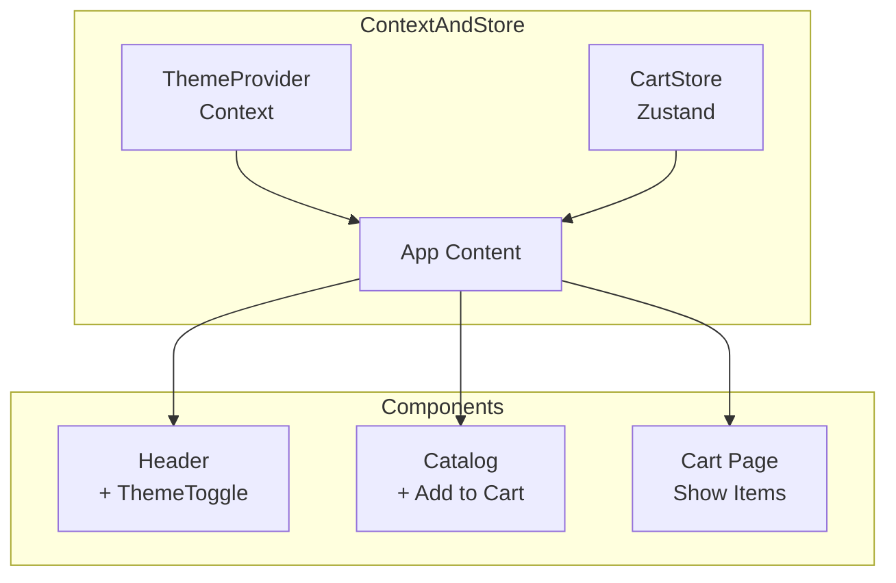
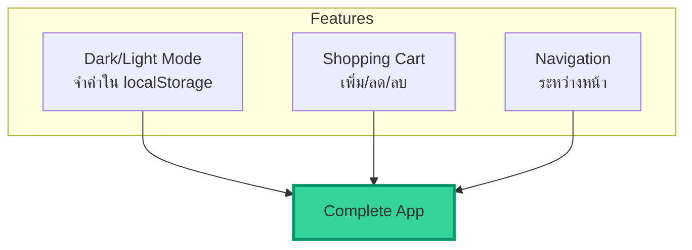

import ChatMessage from "@/components/ChatMessage.astro"

## รวมทุกอย่างเข้าด้วยกัน

ตอนนี้เรามีทั้ง Theme Context และ Cart Store แล้ว มาเชื่อมมันเข้ากับ UI กัน



---

## สร้าง App ที่รวมทุกอย่าง

### Step 1: Mock Data สำหรับ Products

```tsx
// src/data/products.ts
import { Product } from "../types/product"

export const products: Product[] = [
  {
    id: "1",
    name: "Minimalist Watch",
    price: 129,
    image: "https://images.unsplash.com/photo-1523275335684-37898b6baf30?w=400"
  },
  {
    id: "2",
    name: "Leather Bag",
    price: 199,
    image: "https://images.unsplash.com/photo-1548036328-c9fa89d128fa?w=400"
  },
  {
    id: "3",
    name: "Wireless Earbuds",
    price: 89,
    image: "https://images.unsplash.com/photo-1590658268037-6bf12165a8df?w=400"
  },
  {
    id: "4",
    name: "Sunglasses",
    price: 149,
    image: "https://images.unsplash.com/photo-1572635196237-14b3f281503f?w=400"
  }
]
```

### Step 2: สร้าง Catalog Page

```tsx
// src/pages/Catalog.tsx
import { products } from "../data/products"
import { ProductCard } from "../components/ProductCard"

export function Catalog() {
  return (
    <div className="p-4">
      <h1 className="text-3xl font-bold mb-6 dark:text-white">Our Products</h1>
      <div className="grid grid-cols-1 sm:grid-cols-2 lg:grid-cols-4 gap-6">
        {products.map(product => (
          <ProductCard key={product.id} product={product} />
        ))}
      </div>
    </div>
  )
}
```

### Step 3: สร้าง Main App ที่มี Navigation

```tsx
// src/App.tsx
import { useState } from "react"
import { ThemeProvider, useTheme } from "./contexts/ThemeContext"
import { useCartStore } from "./stores/cartStore"
import { Catalog } from "./pages/Catalog"
import { CartPage } from "./components/CartPage"
import { Login } from "./pages/Login"

function AppContent() {
  const [currentPage, setCurrentPage] = useState<"catalog" | "cart" | "login">("catalog")
  const { theme, toggleTheme } = useTheme()
  const items = useCartStore(state => state.items)
  const itemCount = items.reduce((sum, item) => sum + item.quantity, 0)

  return (
    <div className={`min-h-screen ${theme === "dark" ? "dark bg-gray-900" : "bg-gray-50"}`}>
      {/* Header */}
      <header className="bg-white dark:bg-gray-800 shadow-sm">
        <div className="max-w-7xl mx-auto px-4 py-4 flex items-center justify-between">
          <h1 
            className="text-xl font-bold cursor-pointer dark:text-white"
            onClick={() => setCurrentPage("catalog")}
          >
            My Shop
          </h1>
          
          <nav className="flex items-center gap-4">
            <button
              onClick={toggleTheme}
              className="p-2 rounded-lg bg-gray-200 dark:bg-gray-700 hover:bg-gray-300 dark:hover:bg-gray-600 transition-colors"
            >
              {theme === "light" ? "🌙" : "☀️"}
            </button>
            
            <button
              onClick={() => setCurrentPage("cart")}
              className="relative p-2"
            >
              <span className="text-2xl">🛒</span>
              {itemCount > 0 && (
                <span className="absolute -top-1 -right-1 bg-red-500 text-white text-xs rounded-full w-5 h-5 flex items-center justify-center">
                  {itemCount}
                </span>
              )}
            </button>
            
            <button
              onClick={() => setCurrentPage("login")}
              className="px-4 py-2 bg-blue-600 text-white rounded-lg hover:bg-blue-700"
            >
              Login
            </button>
          </nav>
        </div>
      </header>

      {/* Main Content */}
      <main className="max-w-7xl mx-auto px-4 py-8">
        {currentPage === "catalog" && <Catalog />}
        {currentPage === "cart" && <CartPage />}
        {currentPage === "login" && <Login />}
      </main>
    </div>
  )
}

export default function App() {
  return (
    <ThemeProvider>
      <AppContent />
    </ThemeProvider>
  )
}
```

---

## เพิ่ม Dark Mode CSS

เพื่อให้ dark mode ทำงานได้ดี ต้องเพิ่ม CSS นี้:

```css
/* src/index.css */
@tailwind base;
@tailwind components;
@tailwind utilities;

.dark {
  color-scheme: dark;
}

/* สำหรับ input ใน dark mode */
.dark input {
  background-color: #374151;
  border-color: #4b5563;
  color: #f9fafb;
}

.dark input::placeholder {
  color: #9ca3af;
}
```

และเพิ่ม dark mode ใน `tailwind.config.js`:

```js
// tailwind.config.js
export default {
  content: [
    "./index.html",
    "./src/**/*.{js,ts,jsx,tsx}"
  ],
  darkMode: "class", // ใช้ class สำหรับ toggle
  theme: {
    extend: {}
  },
  plugins: []
}
```

---

## ผลลัพธ์ที่ได้



<ChatMessage message="ตอนนี้ app ของเรามีทั้ง dark mode และ shopping cart ที่จำค่าไว้แล้ว!" avatarKey="whiteCat" />

---

## 📝 สรุป

| สิ่งที่ทำ | คำอธิบาย |
|---------|---------|
| ThemeProvider | ห่อ App เพื่อให้เข้าถึง theme ได้ทุกที่ |
| CartStore | เก็บ cart items และจำใน localStorage |
| Header | แสดง theme toggle + cart icon |
| Catalog | แสดง products + ปุ่ม add to cart |
| CartPage | แสดง items ใน cart + แก้ไขได้ |

## 🎯 ต่อไป

[05. Form Validation](./05-form-validation) — เรียนรู้การทำ form validation ด้วย React Hook Form + Zod

import { Quiz } from "@/components/quiz"

<Quiz client:load
  quiz={{
    id: "connect-ui",
    title: "Quiz: เชื่อม UI กับ State",
    questions: [
      {
        id: "q1",
        type: "single",
        question: "ThemeProvider ควรอยู่ตรงไหน?",
        options: ["ในแต่ละ component", "ห่อ App ทั้งหมด", "ใน Header", "ใน Footer"],
        correctAnswer: "ห่อ App ทั้งหมด"
      },
      {
        id: "q2",
        type: "single",
        question: "Cart icon แสดงตัวเลขอย่างไร?",
        options: ["จาก products array", "จาก cart store", "จาก props", "จาก localStorage directly"],
        correctAnswer: "จาก cart store"
      },
      {
        id: "q3",
        type: "single",
        question: "darkMode: 'class' ใน tailwind config หมายความว่าอะไร?",
        options: ["ใช้ system preference", "ใช้ class สำหรับ toggle", "ไม่รองรับ dark mode", "ใช้ media query"],
        correctAnswer: "ใช้ class สำหรับ toggle"
      },
      {
        id: "q4",
        type: "single",
        question: "เมื่อคลิก Add to Cart จะเกิดอะไรขึ้น?",
        options: ["ไม่เกิดอะไร", "เรียก addItem จาก store", "redirect ไปหน้าอื่น", "ล้าง cart"],
        correctAnswer: "เรียก addItem จาก store"
      }
    ]
  }}
/>