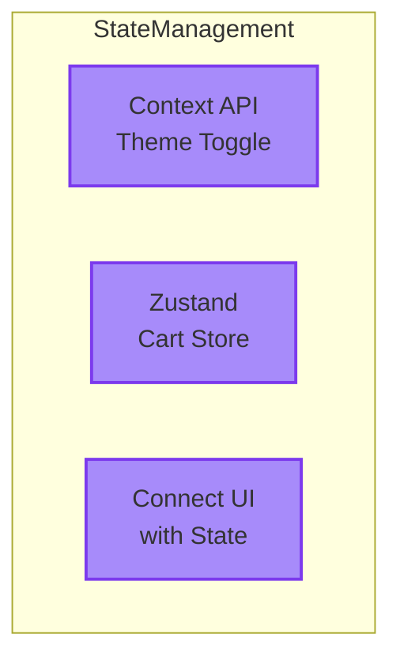

## Part 4: State Management — จัดการ State อย่างมีประสิทธิภาพ

ใน part นี้เราจะเรียนรู้การจัดการ state ขั้นสูงขึ้น:

- **Context** — สำหรับ theme toggle (light/dark mode)
- **Zustand** — สำหรับ cart store ที่ scalable กว่า
- **เชื่อม UI กับ State** — ให้ component ต่าง ๆ สื่อสารกันได้

