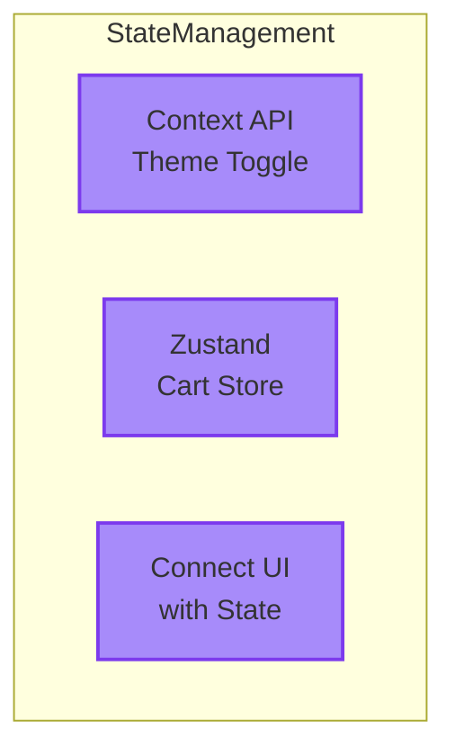

import ChatMessage from "@/components/ChatMessage.astro"

## Part 4: State Management — จัดการ State อย่างมีประสิทธิภาพ

พอมาถึง part นี้แล้วหลายคนอาจจะสงสัย ว่าทำไมต้องใช้ State Management ด้วย

### ปัญหา: Props Drilling

ลองนึกภาพว่าเรามี App ที่มี user ล็อกอิน แล้วต้องส่ง user data ไปทั่วทุก component:

```tsx
function App() {
  const user = { name: "Kao", email: "kao@example.com" }
  return <Dashboard user={user} />
}

function Dashboard({ user }) {
  return (
    <div>
      <Sidebar user={user} />
      <MainContent user={user} />
    </div>
  )
}

function Sidebar({ user }) {
  return <UserProfile user={user} />
}

function MainContent({ user }) {
  return <UserCard user={user} />
}
```

<ChatMessage message="นี่คือสิ่งที่เราเรียกว่า 'Props Drilling' — ส่ง props ผ่าน component ที่ไม่ต้องการมันเลย แค่เพื่อให้ถึง component ที่ต้องการ" avatarKey="whiteCat" />

สิ่งที่เกิดขึ้น:
- **Code ยุ่งเหยิง** — ทุก component ต้องรับ props ที่ไม่ได้ใช้
- **Hard to maintain** — ถ้าเปลี่ยน structure ต้องแก้ทุกที่
- **Prop names ยาวมาก** — `user.profile.settings.theme.color`

### 🎉 เมื่อมี State Management

เมื่อเราใช้ Context หรือ Zustand:

```tsx
// สร้าง store ครั้งเดียว ใช้ได้ทุกที่
const useUserStore = create((set) => ({
  user: null,
  setUser: (user) => set({ user }),
}))

// ใช้งานง่ายๆ ใน component ใดก็ได้
function UserCard() {
  const user = useUserStore((state) => state.user)
  return <div>{user.name}</div>
}
```

<ChatMessage message="ไม่ต้องส่ง props ให้วุ่นวายอีกต่อไป! แค่เรียกใช้ store ได้เลย" avatarKey="whiteCat" />

**ชีวิตดีขึ้นเพราะ:**
- ไม่ต้อง props drilling
- Code อ่านง่าย ดูแลง่าย
- ทุก component เข้าถึง state ได้ตรงๆ
- Scalable ได้ไม่จำกัด

ใน part นี้เราจะเรียนรู้การจัดการ state ขั้นสูงขึ้น:

- **Context** — สำหรับ theme toggle (light/dark mode)
- **Zustand** — สำหรับ cart store ที่ scalable กว่า
- **เชื่อม UI กับ State** — ให้ component ต่าง ๆ สื่อสารกันได้

