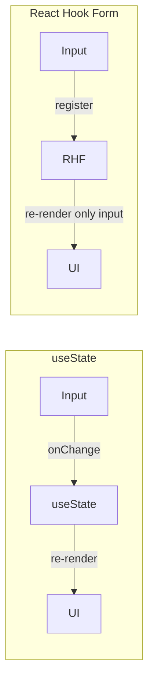
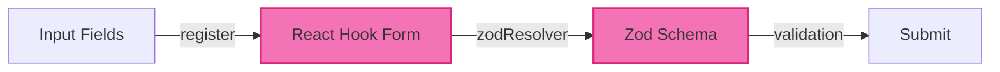

import ChatMessage from "@/components/ChatMessage.astro"

## ทำไมต้อง React Hook Form?

การจัดการ form ด้วย useState มีปัญหาหลายอย่าง:

- **Performance** — เมื่อพิมพ์ทุกตัวอักษร จะ re-render ทั้งหมด
- **Validation** — ต้องเขียน logic เองทุกครั้ง
- **Boilerplate** — ต้องสร้าง state สำหรับแต่ละ field



<ChatMessage message="React Hook Form ใช้ uncontrolled inputs — อ่านค่าตอน submit แทน ทำให้เร็วกว่ามาก!" avatarKey="whiteCat" />

---

## ติดตั้ง Dependencies

```bash
npm install react-hook-form zod @hookform/resolvers
```

- **react-hook-form** — จัดการ form state
- **zod** — schema validation
- **@hookform/resolvers** — เชื่อม RHF กับ Zod

---

## สร้าง Login Form

### Step 1: กำหนด Validation Schema ด้วย Zod

```tsx
// src/schemas/loginSchema.ts
import { z } from "zod"

export const loginSchema = z.object({
  email: z
    .string()
    .min(1, "Email is required")
    .email("Please enter a valid email"),
  password: z
    .string()
    .min(1, "Password is required")
    .min(8, "Password must be at least 8 characters")
    .regex(/[A-Z]/, "Password must contain at least one uppercase letter")
    .regex(/[0-9]/, "Password must contain at least one number")
})

export type LoginFormData = z.infer<typeof loginSchema>
```

### Step 2: สร้าง Login Form Component

```tsx
// src/components/LoginForm.tsx
import { useForm } from "react-hook-form"
import { zodResolver } from "@hookform/resolvers/zod"
import { loginSchema, LoginFormData } from "../schemas/loginSchema"

export function LoginForm() {
  const {
    register,
    handleSubmit,
    formState: { errors, isSubmitting }
  } = useForm<LoginFormData>({
    resolver: zodResolver(loginSchema)
  })

  const onSubmit = async (data: LoginFormData) => {
    // จำลองการ login
    await new Promise(resolve => setTimeout(resolve, 1000))
    console.log("Login success:", data)
    alert(`Welcome back, ${data.email}!`)
  }

  return (
    <form onSubmit={handleSubmit(onSubmit)} className="space-y-4">
      {/* Email Field */}
      <div>
        <label htmlFor="email" className="block text-sm font-medium text-gray-700 dark:text-gray-300">
          Email
        </label>
        <input
          id="email"
          type="email"
          {...register("email")}
          className="mt-1 block w-full px-4 py-2 border rounded-lg focus:ring-2 focus:ring-blue-500 outline-none dark:bg-gray-700 dark:border-gray-600 dark:text-white"
          placeholder="your@email.com"
        />
        {errors.email && (
          <p className="mt-1 text-sm text-red-600">{errors.email.message}</p>
        )}
      </div>

      {/* Password Field */}
      <div>
        <label htmlFor="password" className="block text-sm font-medium text-gray-700 dark:text-gray-300">
          Password
        </label>
        <input
          id="password"
          type="password"
          {...register("password")}
          className="mt-1 block w-full px-4 py-2 border rounded-lg focus:ring-2 focus:ring-blue-500 outline-none dark:bg-gray-700 dark:border-gray-600 dark:text-white"
          placeholder="••••••••"
        />
        {errors.password && (
          <p className="mt-1 text-sm text-red-600">{errors.password.message}</p>
        )}
      </div>

      {/* Submit Button */}
      <button
        type="submit"
        disabled={isSubmitting}
        className="w-full bg-blue-600 text-white py-3 rounded-lg hover:bg-blue-700 disabled:bg-blue-400 disabled:cursor-not-allowed transition-colors font-semibold"
      >
        {isSubmitting ? "Logging in..." : "Login"}
      </button>
    </form>
  )
}
```

### Step 3: ใช้งานใน App

```tsx
// src/pages/Login.tsx
import { LoginForm } from "../components/LoginForm"

export function Login() {
  return (
    <div className="max-w-md mx-auto">
      <h1 className="text-3xl font-bold text-center mb-6 dark:text-white">Login</h1>
      <LoginForm />
      <p className="mt-4 text-center text-gray-600 dark:text-gray-400">
        Don't have an account?{" "}
        <a href="#" className="text-blue-600 hover:underline">Sign up</a>
      </p>
    </div>
  )
}
```

---

## เปรียบเทียบวิธีต่าง ๆ

| วิธี | Performance | Validation | Boilerplate |
|-----|------------|-------------|-------------|
| useState | ต่ำ | เขียนเอง | เยอะ |
| React Hook Form | สูง | มี ready-made | น้อย |
| RHF + Zod | สูง | Schema-based | ปานกลาง |

<ChatMessage message="Zod ไม่ใช่แค่ validate แต่ยัง infer TypeScript types ให้ด้วย!" avatarKey="whiteCat" />

---

## 📝 สรุป



| ส่วน | คำอธิบาย |
|-----|---------|
| `useForm()` | สร้าง form state & methods |
| `register()` | ลงทะเบียน input ให้ RHF จัดการ |
| `zodResolver()` | เชื่อม Zod schema กับ RHF |
| `formState.errors` | แสดง error messages |
| `isSubmitting` | ปิดปุ่มตอน submit |

## 🎯 ต่อไป

[06. Deployment](./06-deployment) — Deploy ขึ้น Vercel กัน!

import { Quiz } from "@/components/quiz"

<Quiz client:load
  quiz={{
    id: "form-validation",
    title: "Quiz: Form Validation",
    questions: [
      {
        id: "q1",
        type: "single",
        question: "React Hook Form ใช้อะไรในการจัดการ input?",
        options: ["useState", "Controlled inputs", "Uncontrolled inputs", "Ref"],
        correctAnswer: "Uncontrolled inputs"
      },
      {
        id: "q2",
        type: "single",
        question: "zodResolver ทำหน้าที่อะไร?",
        options: ["สร้าง form", "เชื่อม Zod กับ RHF", "ส่ง data ไป server", "จัด style"],
        correctAnswer: "เชื่อม Zod กับ RHF"
      },
      {
        id: "q3",
        type: "single",
        question: "z.infer<typeof loginSchema> ทำอะไร?",
        options: ["สร้าง schema", "สร้าง TypeScript type", "Validate data", "Mock data"],
        correctAnswer: "สร้าง TypeScript type"
      },
      {
        id: "q4",
        type: "single",
        question: "isSubmitting ใช้ทำอะไร?",
        options: ["แสดง loading", "Validate ทุก input", "Auto save", "Reset form"],
        correctAnswer: "แสดง loading"
      },
      {
        id: "q5",
        type: "single",
        question: "ถ้า validation fail จะเกิดอะไรขึ้น?",
        options: ["Form หายไป", "Submit ไม่เกิดขึ้น + แสดง error", "Auto fix", "Reload หน้า"],
        correctAnswer: "Submit ไม่เกิดขึ้น + แสดง error"
      }
    ]
  }}
/>