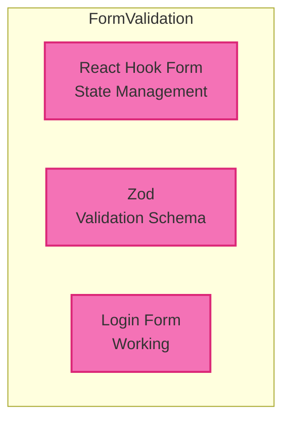

## Part 5: Form Validation — ทำ Form ให้มีประสิทธิภาพ

ใน part นี้เราจะเรียนรู้การทำ form validation อย่างมีประสิทธิภาพ:

- **React Hook Form** — จัดการ form state ง่าย ๆ
- **Zod** — validate data ด้วย schema
- **Login Form ทำงานจริง** — เช็ค email, password และแสดง error

