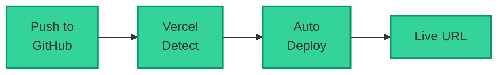
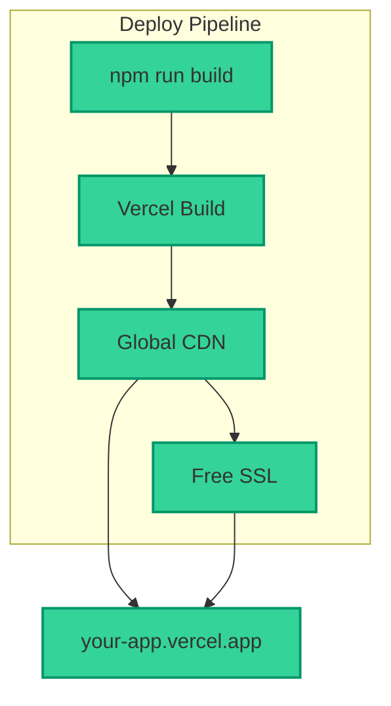
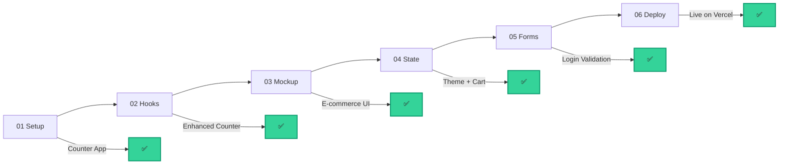

import ChatMessage from "@/components/ChatMessage.astro"

## Vercel คืออะไร?

Vercel เป็น **platform สำหรับ deploy** ที่รองรับ:

- Deploy ให้อัตโนมัติจาก Git
- Free SSL (HTTPS)
- Global CDN
- Preview deployments สำหรับ PR

<ChatMessage message="Vercel เหมาะมากสำหรับ React/Vue/Svelte และ static sites" avatarKey="whiteCat" />

---

## ขั้นตอนการ Deploy

### วิธีที่ 1: Deploy ผ่าน Vercel CLI (แนะนำ)

#### 1. ติดตั้ง Vercel CLI

```bash
npm install -g vercel
```

#### 2. Login ไปยัง Vercel

```bash
vercel login
```

จะเปิด browser ให้ login ด้วย GitHub/GitLab/Bitbucket

#### 3. Deploy โปรเจกต์

```bash
cd my-portfolio
vercel
```

จะมีขั้นตอนให้ตอบ:

```
- Which scope? → [your-username]
- Link to existing project? → No
- What's your project's name? → my-portfolio
- In which directory is your code located? → ./
- Want to modify settings? → No
```

#### 4. รอ Deploy เสร็จ

เมื่อเสร็จจะได้ URL เช่น `my-portfolio.vercel.app`

#### 5. Deploy อีกครั้งหลังแก้ code

```bash
vercel --prod
```

---

### วิธีที่ 2: Deploy ผ่าน GitHub (Auto Deploy)

#### 1. Push code ขึ้น GitHub

```bash
git init
git add .
git commit -m "Initial commit"
git branch -M main
git remote add origin https://github.com/your-username/my-portfolio.git
git push -u origin main
```

#### 2. เชื่อมกับ Vercel

1. ไปที่ [vercel.com](https://vercel.com)
2. คลิก "Add New..." → "Project"
3. เลือก GitHub repository
4. กด "Deploy"



---

## เตรียม Production Build

ก่อน deploy ควรเช็คว่า:

### 1. ใส่ Base URL สำหรับ API

ถ้าเรียก API จาก server อื่น:

```tsx
// src/api/client.ts
const API_BASE_URL = import.meta.env.VITE_API_URL || "https://api.example.com"

export const API = {
  base: API_BASE_URL
}
```

### 2. Build ลองในเครื่องก่อน

```bash
npm run build
```

เช็คว่าไม่มี error

### 3. Preview ด้วย Vercel CLI

```bash
vercel --prebuilt
```

---

## ตั้งค่า Environment Variables

### ผ่าน Vercel Dashboard

1. ไปที่ Project Settings → Environment Variables
2. เพิ่ม variables:

| Variable | ค่าตัวอย่าง |
|----------|------------|
| `VITE_API_URL` | `https://api.example.com` |

### ผ่าน CLI

```bash
vercel env add VITE_API_URL production
```

---

## Custom Domain (Optional)

### 1. ซื้อ Domain

จาก Namecheap, GoDaddy หรือ Cloudflare

### 2. เพิ่มใน Vercel

1. ไปที่ Project Settings → Domains
2. ใส่ domain ที่ซื้อ
3. จะได้ DNS records มาให้ set

### 3. แก้ DNS

ไปที่ domain registrar และเพิ่ม:

```
Type: CNAME
Name: @ (หรือ www)
Value: cname.vercel-dns.com
```

---

## 📝 สรุป

| ขั้นตอน | คำสั่ง/วิธี |
|---------|------------|
| ติดตั้ง CLI | `npm install -g vercel` |
| Login | `vercel login` |
| Deploy | `vercel` |
| Production Deploy | `vercel --prod` |
| Auto Deploy | เชื่อม GitHub |



<ChatMessage message="ทุกครั้งที่ push code ขึ้น GitHub, Vercel จะ deploy ให้อัตโนมัติ และสร้าง preview URL ให้ด้วย!" avatarKey="whiteCat" />

---

## 🎉 ยินดีด้วย!

ตอนนี้คุณได้ deploy website ขึ้น Vercel แล้ว!

สิ่งที่ได้เรียนรู้ตลอด 6 Parts:



- ✅ Vite + React + TypeScript
- ✅ Components & Props
- ✅ Hooks (useState, useEffect, useRef, useMemo)
- ✅ Tailwind CSS
- ✅ TanStack Router
- ✅ Context API (Theme)
- ✅ Zustand (Cart)
- ✅ React Hook Form + Zod
- ✅ Deploy to Vercel

<ChatMessage message="คุณทำได้แล้ว! ตอนนี้คุณมี Portfolio website บน internet จริง ๆ แล้ว 🎉" avatarKey="whiteCat" />

import { Quiz } from "@/components/quiz"

<Quiz client:load
  quiz={{
    id: "deployment",
    title: "Quiz: Deployment",
    questions: [
      {
        id: "q1",
        type: "single",
        question: "Vercel ทำอะไรเมื่อ push code ขึ้น GitHub?",
        options: ["ส่ง email", "Deploy อัตโนมัติ", "ลบ code เก่า", "Block access"],
        correctAnswer: "Deploy อัตโนมัติ"
      },
      {
        id: "q2",
        type: "single",
        question: "คำสั่ง deploy เป็น production คืออะไร?",
        options: ["vercel", "vercel --prod", "vercel deploy", "vercel build"],
        correctAnswer: "vercel --prod"
      },
      {
        id: "q3",
        type: "single",
        question: "Environment variables ควรตั้งค่าที่ไหน?",
        options: ["ใน code", "Project Settings", "terminal", "package.json"],
        correctAnswer: "Project Settings"
      },
      {
        id: "q4",
        type: "single",
        question: "ควรรันคำสั่งอะไรก่อน deploy?",
        options: ["vercel", "npm run build", "npm install", "npm run dev"],
        correctAnswer: "npm run build"
      }
    ]
  }}
/>