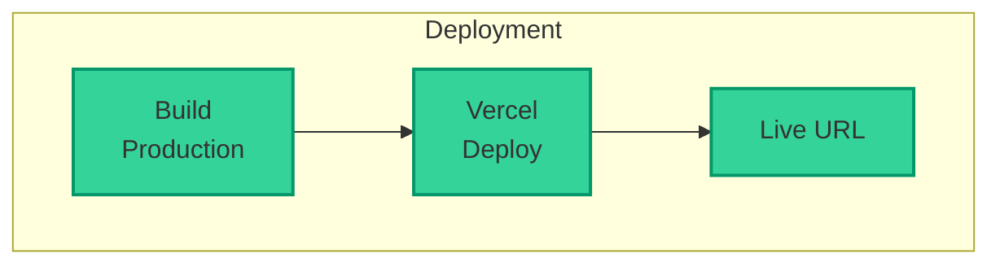

## Part 6: Deployment — ขึ้น Vercel กัน!

ใน part สุดท้ายเราจะ deploy application ขึ้น Vercel:

- **เตรียม Production Build**
- **Deploy ไป Vercel**
- **ตั้งค่า Domain (optional)**

```mermaid
flowchart TB
    subgraph Deployment
        Build[Build<br/>Production] --> Vercel[Vercel<br/>Deploy] --> Live[Live URL]
    end
    
    classDef important fill:#34d399,stroke:#059669,stroke-width:2px
    class Build,Vercel,Live important
```